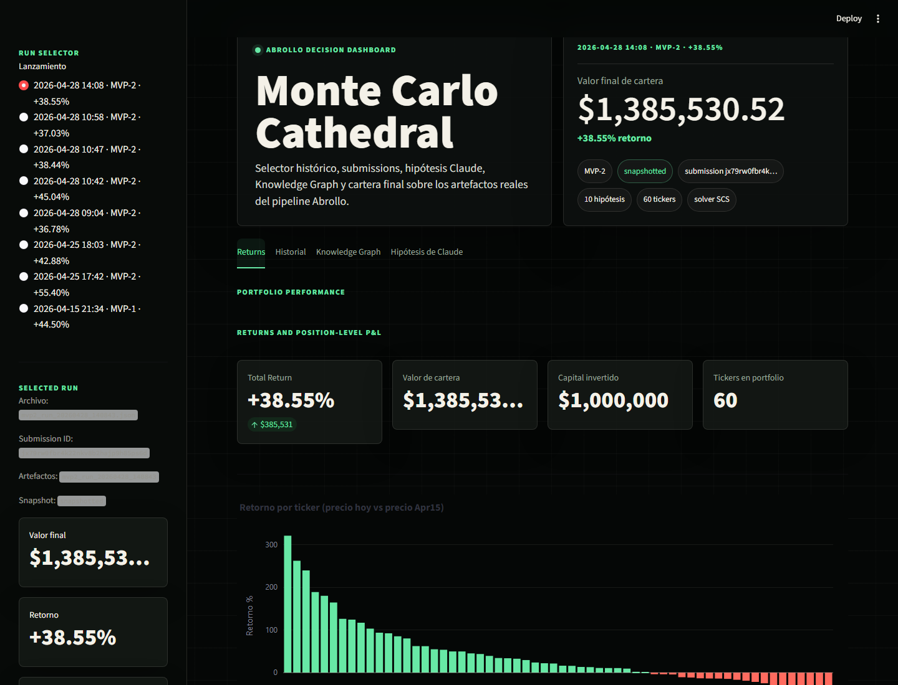

# Abrollo — Monte Carlo Cathedral

Portfolio-construction agent for the **Cala AI Challenge** (Project Barcelona, April 2026).
Team Abrollo: Alex, Nico, Carlos.

> **We don't pick stocks. We pick a shape of uncertainty we're comfortable living with for 12 months.**

## Results

$1M of virtual capital, bought at the 2025-04-15 close, evaluated at 2026-04-15 prices. Benchmark to beat: SPY buy-and-hold.

| Version | Final value | Return | Portfolio | Submission ID |
|--------|-------------|--------|-----------|---------------|
| **MVP-2** | **$1,551,515.14** | **+55.2%** | 60 tickers | `jx704evqag7xry244jxqwcg5qh84x0p4` |
| MVP-1 | $1,473,435.33 | +47.3% | 60 tickers | `jx7czbecp7106ezabxq50f79b984w0kb` |

Both submissions accepted by the endpoint (HTTP 200). Figures verified in `docs/architecture/02-mvp-retro.md` and `04-mvp-2-retro.md`.

## The idea in 60 seconds

The naive approach (what ~80% of teams will do): a swarm of LLMs debates each stock and a "judge" LLM allocates capital. That collapses into scoring by intuition. LLMs are poor market judges, don't model correlations, and don't produce uncertainty distributions.

**Our bet:** let each tool do what it's good at.

- **The LLMs** read Cala text and emit **structured causal hypotheses with citations** (no opinions, only sourced claims).
- **The math** propagates probabilities through a causal graph, simulates thousands of futures, and optimizes the portfolio under uncertainty.
- **Correlations** are explicit in the graph, not implicit in the model's "head".
- The output is a **distribution of outcomes**, not a point prediction.

We don't predict which stocks will win: we enumerate plausible 12-month futures and choose the portfolio that survives well across the whole distribution, especially in the tail (RAND-style war-gaming applied to capital allocation).

### The pipeline (4 stages)

```
  ┌─────────────────────┐   ┌──────────────────┐   ┌──────────────────┐   ┌────────────────────┐
  │ 1. Agents (Claude)  │──▶│ 2. Causal graph  │──▶│ 3. Monte Carlo   │──▶│ 4. Optimization    │
  │                     │   │    (DAG)         │   │                  │   │    CVaR (cvxpy)    │
  │ Read Cala and emit  │   │ Hypotheses →     │   │ N scenarios ×    │   │                    │
  │ hypotheses with     │   │ nodes and edges  │   │ M tickers.       │   │ max E[r] − λ·CVaR  │
  │ citations           │   │ with             │   │ Each row = one   │   │ → 50+ weights =   │
  │ (UUID + date).      │   │ probabilities.   │   │ simulated year   │   │ the final         │
  │ Firewall: every     │   │ Causal           │   │ of the whole     │   │ portfolio.        │
  │ source ≤ 2025-04-15 │   │ propagation.     │   │ world.           │   │                    │
  └─────────────────────┘   └──────────────────┘   └──────────────────┘   └────────────────────┘
        no lookahead               networkx / pgmpy        numpy                  cvxpy / SCS
```

**Cala** is a graph of verified entities (companies, people, laws, papers…), each fact carrying a UUID and timestamp. It's not a search engine or a stock-data provider: it's a substrate of citable facts the agent queries as a tool. The *anti-lookahead firewall* is mechanical: every hypothesis must cite sources dated ≤ 2025-04-15.

The full concept brief lives in **[`IDEA.md`](IDEA.md)**.

## See the data — Streamlit dashboard

The fastest way to understand what we did is to **spin up the dashboard**. The real pipeline artifacts (submissions, graphs, hypotheses, portfolios) are versioned in `data/`, so it works without running the pipeline.

```bash
python -m venv .venv
.venv/bin/pip install -e .                       # on Windows: .venv\Scripts\pip
.venv/bin/pip install -r dashboard/requirements.txt

.venv/bin/streamlit run dashboard/app.py --server.port 8501
```

Open http://localhost:8501. Pick any historical run in the sidebar and explore the tabs:

- **Returns** — final portfolio, value, and return for the selected run.
- **History** — all submissions and their evolution.
- **Knowledge Graph** — the navigable causal DAG (event nodes → mechanisms → tickers).
- **Claude's Hypotheses** — the generated hypotheses with their Cala citations (UUID + date).



## Repo map

```
abrollo/            Pipeline code (installable package)
├── cala/           Cala client, NASDAQ-100 resolution, temporal cutoff
├── agents/         Hypothesis generation and validation (Claude)
├── dag/            Causal graph construction and propagation
├── mc/             Covariance and Monte Carlo simulation
├── opt/            CVaR optimization
└── submit/         Validation and submission to the Convex endpoint

scripts/            Executable step-by-step pipelines
├── step1..step11             MVP-1 (initial end-to-end flow)
└── mvp2_step1..mvp2_step10   MVP-2 (entity graph + correlated MC)
    + mvp2_run_all.py         runs the full MVP-2 in one go

dashboard/          Streamlit app to visualize the artifacts
data/               Versioned artifacts (submissions, graphs, hypotheses…)
docs/architecture/  Design, plans, and retros (see "Where to go next")
IDEA.md             Full concept brief
```

## Run the pipeline (optional)

The dashboard already ships with the data. You only need this if you want to **regenerate** the artifacts.

Requirements: Python `>=3.11` and a `.env` at the root:

```env
CALA_API_KEY=your_api_key
ANTHROPIC_API_KEY=your_api_key
```

**MVP-1** (first run, in order):

```bash
python -m scripts.step1_smoke_test
python -m scripts.step2_resolve_ndx
python -m scripts.step3_introspect
python -m scripts.step4_semi_profiles
python -m scripts.step5_cutoff_test
python -m scripts.step6_semi_hypotheses
python -m scripts.step7_build_dag
python -m scripts.step8_mc
python -m scripts.step9_cvar
python -m scripts.step10_validate
python -m scripts.step11_submit --dry-run
```

Submission modes (`step11_submit.py`): `--dry-run` (prints, no POST) · `--safe` (POST equal-weight 50×$20k) · `--real` (POST with `data/portfolios/mvp.json`).

**MVP-2** (requires `data/nasdaq100_uuids.json` with 99 hits from the prior `step2`):

```bash
python scripts/mvp2_run_all.py          # everything at once
# or step by step: mvp2_step1_preflight.py … mvp2_step10_submit.py
```

## Where to go next

In order, to understand the project in depth:

1. **[`IDEA.md`](IDEA.md)** — the brief and the contrarian thesis.
2. **[`docs/architecture/00-cto-design.md`](docs/architecture/00-cto-design.md)** — technical design.
3. **[`docs/architecture/01-mvp-plan.md`](docs/architecture/01-mvp-plan.md)** and **[`02-mvp-retro.md`](docs/architecture/02-mvp-retro.md)** — MVP-1 plan and retro.
4. **[`docs/architecture/03-mvp-2-plan.md`](docs/architecture/03-mvp-2-plan.md)** and **[`04-mvp-2-retro.md`](docs/architecture/04-mvp-2-retro.md)** — MVP-2 plan and retro (includes known limitations and next steps).
