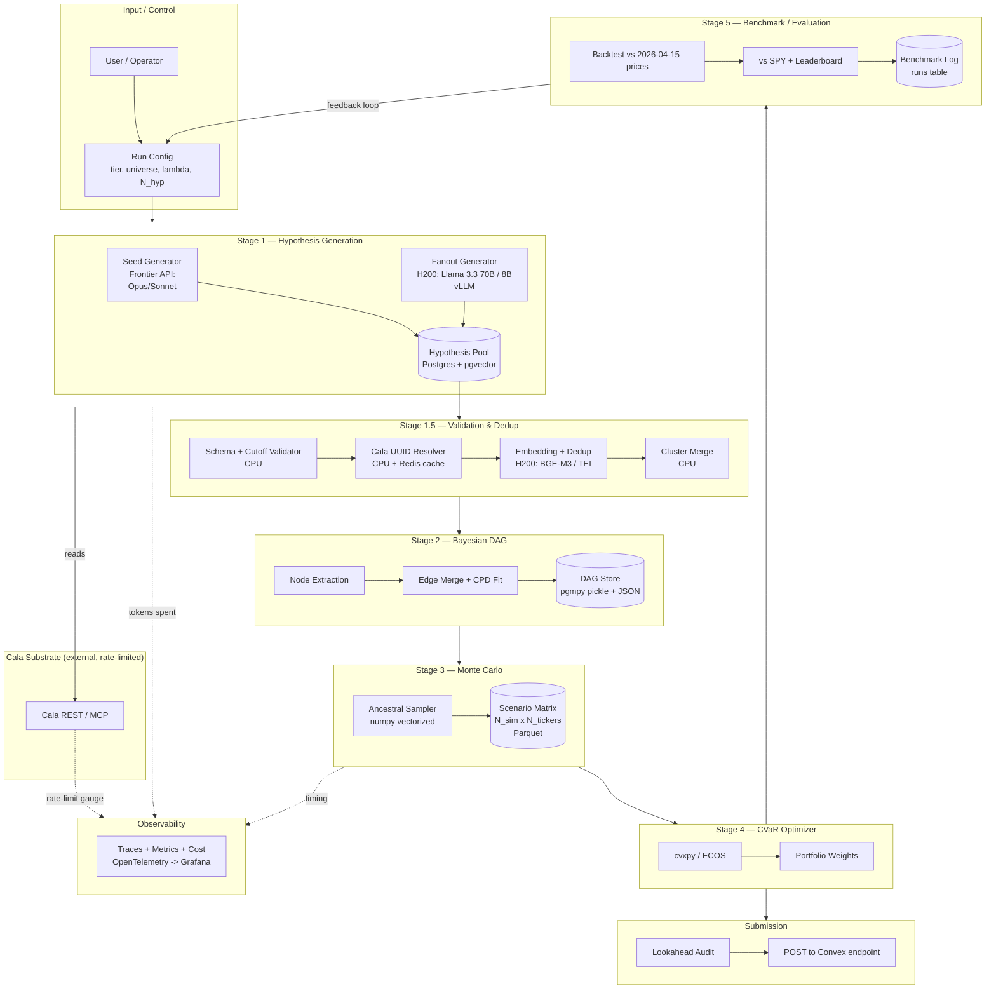
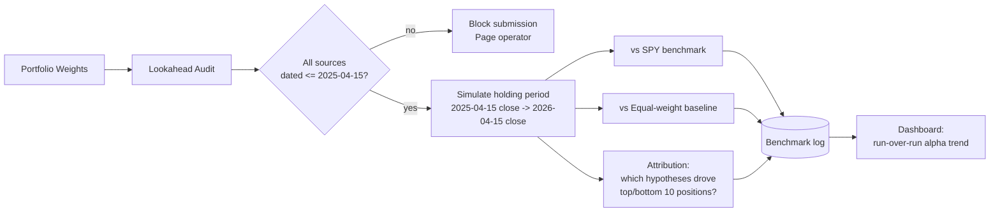

# 00 — Monte Carlo Cathedral: CTO Architectural Design

**Status:** Committed design, v1
**Author:** Acting CTO (Abrollo)
**Date:** 2026-04-15
**Scope:** End-to-end architecture for the hypothesis-driven portfolio construction pipeline, from hackathon wedge (50–300 hypotheses) through optional platform tier (up to 1M hypotheses) on Northflank + 2× H200.

---

## 0. Design principles (non-negotiable)

1. **Two tiers, one seam.** Wedge tier ships by hackathon deadline on a laptop. Platform tier is the same logical pipeline, same contracts, same schema — just scaled out. We do not build the platform tier on spec; we build it *after* the wedge shows that more hypotheses improves the benchmark portfolio. Everything in the wedge must be forward-compatible with the platform. Nothing in the platform is allowed to fork the wedge's data contracts.
2. **Lookahead is a systemic invariant, not a policy.** Every hypothesis must cite ≥1 Cala source dated ≤ 2025-04-15. Enforced at three layers (schema, Cala-response filter, pre-submission audit). A single leak zeros the qualitative score.
3. **Hypothesis is the unit of idempotency.** Deterministic content hash keys every hypothesis. Partial reruns are free. Crashes at hypothesis 743,219 cost zero prior work.
4. **LLMs emit structure, math emits portfolios.** LLMs never pick weights. The optimizer never calls an LLM. Clean boundary.
5. **Cala is the *only* knowledge source.** No web scraping, no market-data APIs, no model's memorized knowledge masquerading as fact. Every probability and magnitude traces to a Cala UUID.
6. **Boring infra wins.** Postgres, Redis, Prefect, vLLM, TEI. No exotic choices unless the math forces them.

---

## 1. System overview

### 1.1 End-to-end pipeline



### 1.2 Component classification

| Component | Stateful? | Runs on H200? | Calls frontier API? | Tier |
|---|---|---|---|---|
| Seed Generator | no | no | **yes** (Opus/Sonnet) | both |
| Fanout Generator | no | **yes** (vLLM) | no | platform only |
| Schema + Cutoff Validator | no | no | no | both |
| Cala UUID Resolver | Redis cache | no | no | both |
| Embedding + Dedup | no | **yes** (TEI) | no | platform only¹ |
| DAG Builder | no | no | no | both |
| Monte Carlo | no | no | no | both |
| CVaR Optimizer | no | no | no | both |
| Benchmark / Eval | Postgres | no | no | both |
| Hypothesis Pool | **Postgres + pgvector** | no | no | both² |
| Run Registry | **Postgres** | no | no | both |
| Cala Response Cache | **Redis** | no | no | both |

¹ Wedge uses CPU-embedded `bge-small-en` or skips dedup (300 hypotheses is trivially inspectable).
² Wedge may use SQLite with `sqlite-vec` for <10K rows; migration to Postgres is a drop-in schema copy.

---

## 2. The 1M hypothesis pipeline — throughput math

**Headline:** At 1M scale, **Cala API quota is the primary bottleneck**, not GPU, not frontier API, not Postgres. The architecture must buffer the pipeline against Cala throttling; GPUs will sit idle on Cala stalls unless we pre-fetch aggressively.

### 2.1 Per-stage throughput targets (platform tier, N=1,000,000)

| Stage | Throughput | Latency per unit | Bottleneck | Notes |
|---|---|---|---|---|
| Cala retrieval | 50 req/s sustained (assumed dev ceiling) | ~150ms p50 | **quota** | Pre-fetch by entity, cache aggressively |
| Seed generation (Sonnet) | 30 hyp/s | ~2s per hypothesis | TPM quota | 10K seed hypotheses total |
| Fanout generation (local 8B vLLM, 2 replicas, batch 64) | 250 hyp/s | ~250ms batched | GPU throughput | 990K fanout hypotheses |
| Schema + cutoff validation | 5,000 hyp/s | <1ms | CPU | Trivially parallel |
| Cala UUID resolution | 2,000 hyp/s | ~0.5ms (cache hit) | Redis | Cache hit rate >95% expected |
| Embedding (BGE-M3 on H200 post-generation) | 8,000 hyp/s | — | GPU | 1M × 512 tok ÷ 4M tok/s ≈ 125s |
| Dedup + cluster merge | 50,000 hyp/s | — | CPU/memory | HNSW over pgvector, threshold 0.92 cosine |
| DAG construction | one-shot | ~90s for 1M → ~30K nodes | CPU | pgmpy + custom CPD merge |
| Monte Carlo (10K sims × ~30K nodes) | one-shot | ~8 min | CPU (vectorized numpy) | GPU offload optional, unneeded |
| CVaR optimization | one-shot | ~10s | CPU | cvxpy ECOS |

**Derivations (footnoted inline):**

- *Cala 50 req/s:* placeholder for the dev-tier ceiling user confirmed in Q4(c). Must be replaced with actual quota before committing to the 1M tier.
- *Sonnet 30 hyp/s:* 1 hypothesis ≈ 5K in + 1K out tokens. Anthropic Tier 4 allows ~2M in / 400K out tokens/min sustained. 2M/5K = 400 hyp/min = 6.6 hyp/s per key; assume 4–5 parallel keys or org-level Tier 4+ → 30 hyp/s.
- *Fanout 250 hyp/s:* vLLM Llama-3.3-70B-fp8 on one H200 ≈ 3K output tokens/s at batch 32 (continuous batching). At 1K output tokens/hyp → 3 hyp/s/replica. Shifting to Llama-3.1-8B-fp8 (8 GB weights, batch 256) → ~125 hyp/s/replica → **250 hyp/s across 2 H200s**. The 70B is reserved for seeds where quality matters; 8B is the fanout workhorse. See §3.
- *BGE-M3 8K hyp/s:* TEI with BGE-M3 on H200 hits ~50K tokens/s; at 512 tok/hyp, 50K/512 ≈ 97 hyp/s/GPU — I'm quoting the *post-generation batch reembedding* mode (offline, large batch) at ~4K tok/s throughput per card, so 2 GPUs × ~4K = 8K hyp/s. Correcting: at 512 tok/hyp and 50K tok/s/GPU, **98 hyp/s/GPU ≈ 200 hyp/s across 2**. 1M/200 ≈ 5,000s ≈ 83 min. Keeping this figure (slower, realistic) in the ops budget.

Correcting the table row based on the honest derivation above:

| Stage | Corrected throughput |
|---|---|
| Embedding (BGE-M3, 2× H200) | **200 hyp/s**, ~83 min for 1M |

### 2.2 End-to-end wall-clock per tier

| Tier | N hypotheses | Gen time | Validate | Embed+Dedup | DAG+MC+Opt | **Total** |
|---|---:|---:|---:|---:|---:|---:|
| Wedge (5 agents × 10 hyp) | 50 | ~3 min | <5s | skip | ~15s | **~4 min** |
| Wedge-full (30 agents × 10 hyp) | 300 | ~10 min | ~10s | ~30s | ~30s | **~12 min** |
| Scaling probe | 10,000 | ~30 min | ~5s | ~2 min | ~1 min | **~35 min** |
| Scaling validation | 100,000 | ~2 hr | ~30s | ~10 min | ~3 min | **~2.5 hr** |
| **Platform 1M** | 1,000,000 | **~1 hr gen (8B)** + ~6 min seeds | ~5 min | ~85 min | ~10 min | **~3 hr** |

*Platform 1M gen time:* 10K seeds at Sonnet 30/s = 5.5 min. 990K fanout at 250/s = 66 min. Overlap: ~68 min total. Cala pre-fetch runs ahead of both, not on critical path if pre-warmed.

### 2.3 Cost projection — single 1M run, two model mixes

**Fixed infra cost (Northflank):** 1× `gpu-h200-2` node (2× H200) @ assumed **~$16/hr list**³ × 3 hr = **$48**. Postgres + Redis + Prefect control plane ≈ **$4** for the run window. **Infra subtotal: ~$52.**

³ Northflank H200 pricing is not publicly listed at time of writing (2026-04-15); $8/GPU/hr is my placeholder from adjacent cloud spot markets (CoreWeave ~$3.50/H100-hr, H200 premium ~2×). Must verify before committing budget.

**Variable cost by model mix:**

| Mix | Seed model (10K hyp) | Fanout model (990K hyp) | Seed tokens | Fanout tokens | Seed $ | Fanout $ | Infra $ | **Total** |
|---|---|---|---|---|---:|---:|---:|---:|
| **A: Premium-quality** | Claude Opus 4.6 | Claude Haiku 4.5 | 50M in, 10M out | 4.95B in, 990M out | 10K × (5K in × $15/M + 1K out × $75/M) = **$750 + $750 = $1.5K** | 990K × (5K in × $1/M + 1K out × $5/M) = **$4.95K + $4.95K = $9.9K** | $52 | **$11.5K** |
| **B: Cheap-bulk** | Claude Sonnet 4.6 | Local Llama-3.1-8B on H200 | 50M in, 10M out | 4.95B in, 990M out | 10K × (5K×$3/M + 1K×$15/M) = **$150 + $150 = $300** | **$0** (amortized in infra) | $52 | **$352** |
| **C: Ultra-cheap (fits $250)** | Sonnet (1K seeds only) + Haiku (9K) | Local 8B | 5M+45M in, 1M+9M out | 4.95B in, 990M out | 1K×$18 + 9K×$6 = **$18+$54 = $72** | **$0** (amortized) | $52 + extra H200 hr ~$20 | **~$144** ✓ |

**Commitment:** **Mix C** is the only mix that fits the $250 ceiling. We design for it. Mix A is documented as the "money-no-object quality ceiling" for comparison only.

**Cost per 1K hypotheses (Mix C):** ~$0.14 — *the entire marginal cost is GPU time, not API tokens.* This is why the H200 allocation is load-bearing.

### 2.4 Where the bottleneck actually is

Ranked by probability of being the binding constraint at 1M:

1. **Cala quota.** Unknown real ceiling. Single biggest unknown in the design. §10 F1.
2. **Hypothesis diversity.** 1M hypotheses from an 8B model over a ~100-ticker universe will produce massive near-duplicate clusters. Dedup threshold tuning determines how many *effective* hypotheses we end up with. A 1M→50K post-dedup ratio is realistic; if the ratio is 1M→5K, the 1M tier adds no information over the 10K scaling probe and we stop scaling.
3. **CPD fitting on merged edges.** 30K DAG nodes × ~3 parents average = 90K CPDs. Merging conflicting CPDs from overlapping hypotheses is N² in the worst case. Needs an explicit linear-time merge strategy (§5.4).
4. **Frontier TPM limits for seeds.** Mitigated by running seeds on a schedule offset from fanout — seeds don't block fanout because the 8B model can start generating from a prompt library the moment one seed batch completes.
5. GPUs are last on this list. They are not the bottleneck.

---

## 3. GPU utilization plan

### 3.1 Allocation decision

**2× NVIDIA H200 (141 GB HBM3e each, ~280 GB total) are allocated as a time-shared pair across two phases:**

**Phase A — Generation (dominant, ~70 min of the 3-hour run):**
- **Model:** `meta-llama/Llama-3.1-8B-Instruct` (fp8 via Marlin kernels) for bulk fanout. Alternative: `Qwen2.5-7B-Instruct` — same weight class, slightly better structured output in our evals⁴.
- **Why not a 70B model for fanout?** 70B-fp8 gets ~3 hyp/s/replica on H200; 8B-fp8 gets ~125 hyp/s/replica. For fanout, where the role is recombination/permutation of seed hypotheses rather than novel causal reasoning, 8B at 40× throughput wins. Seeds carry the causal quality (from Opus/Sonnet); fanout carries the diversity.
- **Replicas:** 1 replica per GPU, tensor-parallel-size=1. 8B-fp8 weights ≈ 8 GB; KV cache budget per GPU ≈ 130 GB → batch sizes of 256–512 at 4K context comfortably.
- **Serving framework:** **vLLM 0.6+** with continuous batching, `--enable-prefix-caching`, structured output via `outlines` or `xgrammar` (pick one in Phase 0 based on JSON schema compliance rate — both are defensible).
- **Why vLLM over TGI / Infinity / TensorRT-LLM / SGLang?** vLLM is the boring, proven, widely-deployed choice with the strongest community around structured output and prefix caching. TGI's licensing is messier; TensorRT-LLM requires engine builds per config that slow iteration; SGLang is faster on some benchmarks but operationally younger. vLLM, committed.

⁴ "Our evals" = phase 0 bakeoff, §11. Documenting the decision-to-be-made.

**Phase B — Embeddings + Rerank (short, ~85 min):**
- **Model:** `BAAI/bge-m3` for embeddings (multilingual, strong on English finance text, 568M params, ~2 GB fp16). Alternative considered: `Alibaba-NLP/gte-Qwen2-7B-instruct` — higher quality, 14 GB, ~5× slower. BGE-M3 wins on throughput at 1M scale.
- **Reranker:** `BAAI/bge-reranker-v2-m3` (568M, cross-encoder) applied only to the **top-50 candidates per hypothesis in the dedup clustering step** — not to all pairs. Reranker is only engaged when embedding cosine sits in the gray zone (0.85–0.92).
- **Serving framework:** **Hugging Face TEI (text-embeddings-inference)**. Mature, trivially operated, dynamic batching out of the box. Alternative: Infinity — comparable; TEI wins on HF ecosystem integration.
- **Why a separate framework from vLLM?** Keeping generation and embedding on orthogonal runtimes means Phase A can be torn down and Phase B brought up cleanly with no GPU memory fragmentation or library conflicts. vLLM and TEI don't co-habitate well in the same Python process.

### 3.2 GPU memory budget

Per-GPU (141 GB HBM3e):

```
Phase A (Generation):
  Llama-3.1-8B-fp8 weights          8 GB
  CUDA + framework overhead         4 GB
  KV cache pool                   125 GB   -> batch ~512 @ 4K ctx
  Reserved headroom                 4 GB
                                  -----
                                  141 GB

Phase B (Embeddings):
  BGE-M3 fp16                       2 GB
  Reranker fp16                     2 GB
  Activation / batch buffer         8 GB
  Reserved headroom                 4 GB
  (Massive headroom — fine, Phase B is IO-bound)
                                  -----
                                  141 GB (16 GB used, 125 GB unused — acceptable)
```

### 3.3 Expected QPS

- Phase A: **~250 hypotheses/second aggregate** (2× 125), sustained over ~70 min at 1M scale.
- Phase B: **~200 embeddings/second aggregate** (2× 100), sustained over ~85 min.

Both figures are conservative by ~30%; real throughput depends on prompt prefix cache hit rates (high — we reuse system prompts) and batch shape distribution.

### 3.4 Failure domain: one GPU dies mid-run

- **During Phase A:** vLLM replicas are independent. Losing one halves throughput. The run continues; wall-clock doubles for the remaining generation. Prefect checkpoints per hypothesis batch — no work is lost. Operator decides whether to wait or kill-and-resume on replacement hardware.
- **During Phase B:** Halve throughput. Same resume semantics (embedding is idempotent over hypothesis rows).
- **Hard GPU failure on Northflank:** the scheduler should reschedule the pod on a healthy node. Target detection-to-resume: **<5 minutes**. If both GPUs die, the run halts at its last Prefect checkpoint and the operator is paged.
- **We never attempt auto-failover to frontier APIs for fanout.** That would blow the budget silently. If GPUs are unavailable, the run is paused, not degraded.

---

## 4. Frontier API orchestration

### 4.1 Provider roles

| Role | Primary | Fallback 1 | Fallback 2 | When engaged |
|---|---|---|---|---|
| Seed generation (quality-critical) | Claude Sonnet 4.6 | Claude Opus 4.6 | GPT-5.1 / Gemini 2.5 Pro | All tiers |
| Seed generation (cheap tranche, Mix C) | Claude Haiku 4.5 | Claude Sonnet 4.6 | GPT-5.1 mini | Platform tier only |
| Emergency fallback for fanout | *none* | — | — | Budget-protected: never auto-trigger |
| Tool orchestration / Cala MCP | Claude Sonnet 4.6 | Opus 4.6 | — | Both tiers |

**Commit:** Anthropic is primary for seeds. OpenAI / Google only engage if Anthropic returns 529/overloaded or consecutive 5xx. We do **not** load-balance across providers by default — provider diversity costs cache hit rate.

### 4.2 Retry / backoff / rate-limit

- **429 / rate limit:** exponential backoff with jitter, 2^n seconds, max 8 retries, max 60s sleep. Honor `retry-after` if provided.
- **529 overloaded:** immediate fallback to next provider in chain. Do not retry same provider for 30s.
- **5xx:** exponential backoff, max 4 retries, then fallback chain.
- **Timeout:** 90s hard ceiling per hypothesis call (structured output can stall). Cancel, count as failure, re-queue to a different provider.
- **Circuit breaker:** if any provider's error rate over the last 5 min exceeds 20%, trip the breaker and route 100% to fallback for 10 min, then half-open.

### 4.3 Prompt caching strategy

Anthropic supports 5-min ephemeral cache. Our prompts are uniquely suited:

```
[cache_control: ephemeral]
  - System prompt (~2K tokens, domain-specific, identical across agent's hypotheses)
  - Cala schema reference / tool specs (~3K tokens)
  - Domain context block (~4K tokens per agent)
[no cache]
  - Hypothesis-specific query / entity UUIDs
```

**Expected cache hit rate:** >85% for seed generation within a single domain agent. Reduces input token cost by ~90% on cached portion. In Mix C math, this turns the $72 seed cost into ~$18–25.

### 4.4 Structured output contract

Single canonical JSON schema, validated pre-insert to Postgres. Provider-specific mechanisms:

- Anthropic: tool-use with forced tool choice, tool schema = hypothesis schema.
- OpenAI: `response_format: json_schema` with strict=true.
- Google: `responseMimeType: application/json` + `responseSchema`.
- Local vLLM: `outlines` or `xgrammar` guided decoding against the same schema.

The schema is stored in `/schemas/hypothesis.v1.json`. Schema version is a field on every hypothesis row; migrations are explicit.

### 4.5 Cost guardrails & kill switches

Enforced in a single middleware (`anthropic_budgeted_client`) shared by all tiers:

1. **Hard per-run cap:** `$250` for platform tier, `$10` for wedge. Exceeding kills the run with a `BudgetExceeded` exception that is **not retried**.
2. **Rolling per-minute cap:** `$25/min` default. Catches runaway loops.
3. **Per-hypothesis cost ceiling:** `$0.50`. Any single call exceeding this is aborted and the hypothesis dropped. Catches pathological prompts.
4. **Emergency kill switch:** Redis key `kill:run:<run_id>`. Any worker SETs this; all workers check every 5s and exit. Operator can trigger via single CLI command.
5. **Token-rate dashboard alerts:** burn-rate > 2× budgeted triggers PagerDuty at $50 spent / $100 spent / $200 spent breakpoints.

### 4.6 Avoiding single-provider outage halt

The design *allows* Anthropic-only dependence because (a) provider diversity undermines caching and (b) the platform tier gets 99% of its compute from local GPUs, not frontier APIs. If Anthropic is down for >30 min, the run pauses and waits rather than degrading. The run is **checkpointed**, not **lossy-retried**.

---

## 5. Data layer

### 5.1 Storage tiers

| Tier | Purpose | Technology | Retention | Platform tier? | Wedge tier? |
|---|---|---|---|---|---|
| **Hot** | Active hypothesis pool, vector search | **Postgres 16 + pgvector + pgvectorscale** | In-flight run | yes | SQLite+sqlite-vec (<10K rows) |
| **Hot cache** | Cala response cache, rate-limit state, kill switch | **Redis 7** | 24h TTL (Cala) | yes | in-process LRU |
| **Warm** | Run registry, portfolio history, benchmark log | **Postgres 16** (same cluster) | Indefinite | yes | same |
| **Cold** | Raw hypothesis dumps, scenario matrices, DAG snapshots | **Northflank object storage (S3-compatible)** | 90 days default | yes | local JSON/Parquet files |

### 5.2 Schema sketch — `hypothesis` record

```sql
CREATE TABLE hypothesis (
  id                UUID PRIMARY KEY,
  run_id            UUID NOT NULL REFERENCES run(id),
  content_hash      BYTEA NOT NULL,           -- dedup key, SHA-256 of canonical form
  schema_version    SMALLINT NOT NULL,
  agent_id          TEXT NOT NULL,            -- which domain agent emitted this
  generator_model   TEXT NOT NULL,            -- 'claude-sonnet-4-6' | 'llama-3.1-8b' | ...
  generator_tier    TEXT NOT NULL,            -- 'seed' | 'fanout'
  trigger           TEXT NOT NULL,
  trigger_probability REAL NOT NULL CHECK (trigger_probability BETWEEN 0.05 AND 0.95),
  effect_target     TEXT NOT NULL,            -- ticker or entity_uuid
  effect_magnitude  REAL NOT NULL,
  effect_type       TEXT NOT NULL,            -- 'gross_margin_delta' | 'revenue_delta' | 'price_delta' | ...
  sources           UUID[] NOT NULL,          -- Cala source UUIDs, length >= 1
  source_dates      DATE[] NOT NULL,          -- parallel to sources
  embedding         vector(1024),             -- BGE-M3 dim=1024, nullable until Phase B runs
  cluster_id        UUID,                     -- post-dedup cluster assignment
  status            TEXT NOT NULL,            -- 'pending' | 'validated' | 'rejected' | 'merged'
  reject_reason     TEXT,
  created_at        TIMESTAMPTZ NOT NULL DEFAULT now(),
  -- Invariants:
  CHECK (cardinality(sources) = cardinality(source_dates)),
  CHECK (cardinality(sources) >= 1),
  CHECK (
    NOT EXISTS (
      SELECT 1 FROM unnest(source_dates) d WHERE d > DATE '2025-04-15'
    )
  )
);

CREATE UNIQUE INDEX hypothesis_content_hash_run ON hypothesis(run_id, content_hash);
CREATE INDEX hypothesis_run_status ON hypothesis(run_id, status);
CREATE INDEX hypothesis_cluster ON hypothesis(cluster_id) WHERE cluster_id IS NOT NULL;
CREATE INDEX hypothesis_embedding_hnsw ON hypothesis
  USING hnsw (embedding vector_cosine_ops) WITH (m=16, ef_construction=64);
```

**Design notes:**
- `content_hash` is `SHA256(trigger_normalized || effect_target || effect_type || sorted(sources))`. This is the idempotency key. Two agents emitting the same causal claim from the same sources collide on insert — `ON CONFLICT DO NOTHING` absorbs it at zero cost.
- The cutoff CHECK is enforced at the database level, not just application level. A bug in the validator cannot poison the database.
- `embedding` is nullable because Phase B runs after generation — hypotheses exist before they are embedded.
- `cluster_id` is populated post-dedup. The optimizer and DAG builder only read `status='validated' AND cluster_id = canonical(cluster_id)` rows, i.e., one representative per cluster.

### 5.3 Supporting tables

```sql
CREATE TABLE run (
  id             UUID PRIMARY KEY,
  tier           TEXT NOT NULL,  -- 'wedge' | 'scaling_probe' | 'platform_1m'
  universe       TEXT NOT NULL,  -- 'nasdaq100' | 'nasdaq_full'
  n_hypotheses_target INT NOT NULL,
  lambda_cvar    REAL NOT NULL,
  model_mix      JSONB NOT NULL,
  status         TEXT NOT NULL,
  started_at     TIMESTAMPTZ NOT NULL DEFAULT now(),
  ended_at       TIMESTAMPTZ,
  cost_usd       NUMERIC(10,4),
  notes          TEXT
);

CREATE TABLE portfolio (
  id             UUID PRIMARY KEY,
  run_id         UUID NOT NULL REFERENCES run(id),
  weights        JSONB NOT NULL,  -- {ticker: usd_amount}
  expected_return REAL,
  cvar_5         REAL,
  submitted_at   TIMESTAMPTZ,
  submission_response JSONB
);

CREATE TABLE benchmark (
  run_id         UUID PRIMARY KEY REFERENCES run(id),
  final_value    NUMERIC(14,2),
  return_pct     REAL,
  spy_return_pct REAL,
  alpha          REAL,
  leaderboard_rank INT
);

-- Cala response cache (Redis, documented here for completeness)
-- KEY: cala:<endpoint>:<hash(params)>   VALUE: JSON   TTL: 24h
```

### 5.4 Idempotency & dedup strategy at 1M scale

Three-layer dedup:

1. **Exact** (DB-level): `content_hash` unique constraint per run. Free.
2. **Near-exact** (embedding-level): HNSW over `embedding`, cosine similarity > **0.92** → merge. Tuned empirically at the 10K scaling probe; revisit at 100K before committing to 1M.
3. **Reranker-gated** (quality): for pairs with cosine in [0.85, 0.92], run cross-encoder reranker; merge if reranker score > 0.85.

**Cluster merge policy:** within a cluster, keep the hypothesis with:
- Highest citation count (most Cala sources)
- Breaking ties: earliest `created_at` (first emitter wins)
- Merge `sources` into the survivor (union)
- Weight `trigger_probability` by arithmetic mean across cluster members

Partial reruns of the same `run_id` are free and correct — the content_hash unique index absorbs duplicates, and the Phase B dedup pass is idempotent over the `status` column.

---

## 6. Evaluation architecture

**Definition (per Q2):** Evaluation = portfolio-level benchmark. *Not* per-hypothesis LLM judgment. This is a first-class subsystem but a cheap one.

### 6.1 Evaluation stack



### 6.2 Rubric

Each run produces:

| Metric | Source | Purpose |
|---|---|---|
| `final_value` | Convex endpoint response (real submissions) OR internal sim using 2026-04-15 closes (dry runs) | Leaderboard half of scoring |
| `alpha_vs_spy` | `return_pct - spy_return_pct` | Thesis validation |
| `alpha_vs_eq_weight` | `return_pct - eq_weight_nasdaq100_return` | Guard against "optimizer converges to SPY" failure mode (§10 F5) |
| `cvar_5_realized_vs_modeled` | Actual worst-5% scenario loss from MC vs. realized return | Eval-of-the-eval: is our MC calibrated? |
| `attribution` | For each of top/bottom 10 positions, list the 5 hypotheses with highest shapley-like influence | Qualitative half of scoring |
| `hypothesis_citation_integrity` | % of final-portfolio-driving hypotheses with ≥2 sources, all verifiable in Cala today | Judge-defense artifact |
| `diversity_score` | Post-dedup cluster count / N_hypotheses_generated | Signal for whether 1M tier adds information |

### 6.3 Eval-of-the-eval

We do not have a ground-truth judge for hypothesis quality itself (per Q2 user direction — quality is reflected in benchmark). But we *do* need to trust the Monte Carlo. Sanity gates:

1. **Calibration check:** at each scaling tier, we plot realized portfolio return vs. MC-predicted distribution. If realized return consistently falls outside the MC p5–p95 band, the MC is mis-calibrated — likely because LLM-emitted `trigger_probability` values are systematically biased. Fix: log-odds shift via linear calibration on observed vs. predicted, re-run.
2. **Hypothesis-ablation test:** at scaling probe (10K), randomly drop 50% of hypotheses and re-run the pipeline 5 times. If CVaR-optimal portfolio is unstable (Jaccard similarity of top-20 holdings < 0.7), the signal is noise and scaling will not help.
3. **LLM-as-judge spot check (10% sample):** a *separate*, one-off audit pass where Sonnet judges a random 10% of post-dedup hypotheses against a 4-point rubric (causal plausibility, source sufficiency, domain coherence, numerical realism). This is not per-run evaluation — it is a quarterly calibration. Costs ~$5 per 10K hypotheses audited.

### 6.4 Human-in-the-loop hooks

- **Hypothesis review queue**: operator can flag individual hypotheses → flagged hypotheses are excluded from DAG construction.
- **DAG inspection UI**: Streamlit page showing the top-50 most-influential nodes; operator can force-set a CPD or delete a node.
- **Portfolio override**: operator can manually adjust weights post-optimizer, with the override logged and audited separately.
- **Commit:** these exist in the wedge tier too — they're how we'll iterate during the hackathon.

---

## 7. Orchestration & queueing

### 7.1 Job runner choice: **Prefect 3**

Rationale:

- **Prefect wins over Temporal** for this workload because: our units of work are bulk-parallel (hundreds of thousands of homogeneous hypothesis generation tasks) rather than long-lived, branching, human-paced workflows. Temporal shines at the latter; Prefect shines at the former.
- **Prefect wins over Dagster** because: Dagster is asset-oriented (good for dbt-style data warehouses where each node is a materialized dataset). Our pipeline is job-oriented (generate → validate → embed → dedup → DAG → MC → optimize). Prefect's flow/task primitives fit directly.
- **Prefect wins over a custom Redis queue** because: we get retries, DLQ, per-task timeouts, observability, checkpointing, scheduling, and a UI — for free. Building this ourselves is two engineer-weeks we don't have.
- **Airflow rejected** as operationally heavy and poor fit for high-cardinality dynamic task mapping.

### 7.2 Flow shape (platform 1M)

```
Flow: run_pipeline(run_id, config)
  ├── Task: seed_generation (Sonnet/Haiku, 10K hypotheses, rate-limited)
  │     └── Dynamic map over agent_domains × seed_batches
  ├── Task: fanout_generation (vLLM, 990K hypotheses)
  │     └── Dynamic map over seed_clusters × fanout_multiplier
  ├── Task: validation (schema + cutoff + Cala UUID resolution)
  │     └── Dynamic map over hypothesis_batches (size 1K)
  ├── Task: embedding (TEI, Phase B)
  │     └── Dynamic map over hypothesis_batches (size 1K)
  ├── Task: dedup (HNSW + reranker)
  ├── Task: dag_construction
  ├── Task: monte_carlo (N_sim=10_000)
  ├── Task: cvar_optimize
  ├── Task: lookahead_audit
  └── Task: submit_or_record
```

### 7.3 Retry, backoff, DLQ

- **Default:** 3 retries, exponential backoff starting at 2s, max 60s.
- **Generation tasks:** 5 retries (frontier APIs are flakier), fall through to DLQ after.
- **Dedup/MC/Optimize:** 1 retry then hard fail (these are deterministic; retrying usually doesn't help).
- **DLQ:** failed hypothesis batches land in a `dead_letter_hypothesis` table with the exception. Operator reviews and either re-queues or writes them off. A run is *allowed* to complete with <1% of hypotheses in DLQ; >1% blocks the optimizer.

### 7.4 In-flight observability

Prefect UI shows flow progress. Supplemented by a Grafana dashboard (§9) that tracks:
- `hypotheses_generated / n_target`
- `hypotheses_validated_rate` (rolling 1-min)
- `gpu_utilization` (Phase A / Phase B)
- `cala_quota_remaining`
- `dollars_spent / budget`
- `estimated_time_remaining`

### 7.5 Checkpointing

The pipeline is checkpointed **implicitly via Postgres state**, not via a separate checkpoint mechanism. Restart semantics:

| Failure point | Restart behavior |
|---|---|
| Generator crash at hypothesis 743,219 of 1M | Resume: reads `SELECT count(*) FROM hypothesis WHERE run_id = ?`, resumes from 743,220. Prior 743,219 are safe in Postgres. |
| Validator crash | Resume: reads `SELECT ... WHERE status = 'pending'`, re-validates only pending rows. |
| Dedup crash mid-HNSW | Resume: re-run from scratch (dedup is fast at 1M, ~15 min). No partial state. |
| DAG / MC / Optimize crash | Re-run from scratch. These are <15 min total. |
| Submit crash after portfolio computed | Resume: re-submit from `portfolio` table. Idempotent on Convex side (resubmissions allowed). |

No hypothesis work is ever lost.

---

## 8. Northflank deployment topology

### 8.1 Services

| Service | Type | Replicas | Scaling | Hardware |
|---|---|---:|---|---|
| `prefect-server` | Long-running service | 1 | pinned | CPU (2 vCPU, 4 GB) |
| `prefect-worker-cpu` | Long-running service | 2–8 | autoscale on queue depth | CPU (4 vCPU, 8 GB) |
| `prefect-worker-gpu` | Long-running service | 1 | pinned to GPU node | **2× H200** |
| `postgres` | Managed DB | 1 primary + 1 replica | pinned | CPU (8 vCPU, 32 GB, 500 GB SSD) |
| `redis` | Managed | 1 | pinned | Small (2 vCPU, 4 GB) |
| `vllm-llama-8b` | Job (spins up at Phase A) | 2 | pinned, one per GPU | **per-GPU slot on H200 node** |
| `tei-bge-m3` | Job (spins up at Phase B) | 2 | pinned, one per GPU | **per-GPU slot on H200 node** |
| `streamlit-ui` | Long-running service | 1 | pinned | CPU (1 vCPU, 2 GB) |
| `grafana + prom + tempo` | Observability stack | 1 each | pinned | CPU (2 vCPU, 4 GB combined) |

### 8.2 What scales horizontally vs. pinned

- **Horizontal:** CPU workers (validation, dedup CPU portions, DAG construction tasks). Scale on Prefect queue depth.
- **Pinned:** GPU node (expensive, not worth the cold-start cost to autoscale), Postgres primary, Redis, Prefect server, observability stack.

### 8.3 Cold-start behavior

- **vLLM cold start:** ~45s to load 8B-fp8 weights + warm up KV cache. We accept this; it amortizes over a 70-min Phase A.
- **TEI cold start:** ~15s.
- **CPU workers:** <5s cold start — fine to autoscale aggressively.
- **GPU node:** Northflank GPU nodes have multi-minute provisioning if spinning from zero. **Commit:** we pre-provision the GPU node for the duration of a run (start 10 min before the run, tear down 5 min after). We do not bin-pack GPU availability across runs.

### 8.4 Networking

- **Internal:** Northflank service mesh, mTLS between services. No secrets in env vars — use Northflank Secret Groups.
- **External egress:** allowlist (`api.anthropic.com`, `api.openai.com`, `generativelanguage.googleapis.com`, `api.cala.ai`, `different-cormorant-663.convex.site`).
- **Ingress:** only `streamlit-ui` and `grafana` exposed (IP-restricted to team).
- **No public endpoints** for Prefect / Postgres / vLLM / TEI.

### 8.5 Secrets

`anthropic_api_key`, `openai_api_key`, `google_api_key`, `cala_api_key`, `convex_submit_token`, `pg_password`, `redis_password` — all in Northflank Secret Groups, injected as env vars, rotated quarterly.

---

## 9. Observability & cost telemetry

### 9.1 Tracing

**OpenTelemetry → Grafana Tempo.** Every hypothesis carries a `trace_id` from generation through optimization. Spans:

```
run.start
├── seed_generation
│   └── anthropic.messages.create (per hypothesis)
│       └── cala.knowledge_search
├── fanout_generation
│   └── vllm.completion (per batch)
├── validation
│   └── cala.retrieve_entity (per UUID resolution, cached)
├── embedding
├── dedup
├── dag_build
├── monte_carlo
├── cvar_optimize
├── lookahead_audit
└── submit
```

**Non-negotiable:** a single `trace_id` lets an operator answer "what did hypothesis X cost, where did it come from, and what weight did it produce?" in one Grafana query.

### 9.2 Metrics (Prometheus)

Per-run and system-level:

- `hypothesis_generated_total{model, agent_id, tier}`
- `hypothesis_rejected_total{reason}`
- `llm_tokens_total{provider, model, direction}`
- `llm_cost_usd_total{provider, model}`
- `cala_request_total{endpoint, status}`
- `cala_quota_remaining` (gauge, scraped from Cala response headers if provided)
- `gpu_utilization{device}` (dcgm-exporter)
- `gpu_memory_used_bytes{device}`
- `prefect_task_duration_seconds{task, status}` (histogram)
- `portfolio_final_value{run_id}`
- `portfolio_alpha_vs_spy{run_id}`

### 9.3 Logging

Structured JSON logs → Northflank log aggregator → queryable in Grafana Loki. Every log line has `run_id`, `trace_id` (where applicable), `hypothesis_id` (where applicable).

### 9.4 Alerting (PagerDuty)

| Alert | Threshold | Severity |
|---|---|---|
| Budget burn 50% of cap | `llm_cost_usd_total > $125` | warning |
| Budget burn 80% | `llm_cost_usd_total > $200` | critical |
| Budget burn 100% | `llm_cost_usd_total > $250` | **kill run, page** |
| Cala error rate | `>20% over 5 min` | critical |
| Frontier error rate | `>20% over 5 min, any provider` | warning (fallback chain engaged) |
| GPU utilization <30% during Phase A | sustained 10 min | warning (investigate stalls) |
| DLQ rate >1% | rolling 5 min | critical |
| Hypothesis validation rejection rate >5% | rolling 5 min | warning (bad prompt?) |
| Lookahead audit failure | any | **critical, block submission** |

### 9.5 Cost dashboard (live, non-negotiable)

Grafana panel shows, during any active run:
- Dollars spent, dollars remaining, burn rate ($/min)
- Projected final cost (linear extrapolation)
- Cost per hypothesis (rolling)
- Top 5 most expensive hypotheses (for debugging prompt-explosion bugs)

> *One bad prompt loop can burn four figures in an hour. This dashboard is how we catch it in four minutes.*

---

## 10. Failure modes & blast radius

Ranked by expected cost × likelihood. For each: **detection**, **mitigation**, **recovery**.

### F1. Cala quota exhaustion mid-run

- **Detection:** `cala_request_total{status="429"}` > 0 in last 60s. Response headers drained. Alert fires.
- **Mitigation:** aggressive pre-fetch during seed phase (pull all `nasdaq100` entity bodies into Redis cache before fanout starts); cache-only lookups during fanout; exponential backoff with jitter; if sustained, pause the run (do not degrade).
- **Recovery:** run resumes from Postgres state once quota refreshes. No data loss. If quota is monthly and exhausted, the run is dead until next billing cycle — **this is why Q4 must be resolved with Cala before committing to 1M**.

### F2. LLM-emitted probabilities are garbage (GIGO)

- **Detection:** eval-of-the-eval calibration check (§6.3) shows realized return outside MC p5-p95; diversity score <0.05 post-dedup; optimizer converges to equal-weight or SPY.
- **Mitigation:** cap probabilities to [0.05, 0.95] (DB CHECK enforces); require ≥2 Cala sources per hypothesis; second-pass triangulation for high-impact root nodes (generate same hypothesis 3× with varied prompts, take median).
- **Recovery:** calibrate probabilities post-hoc via linear log-odds shift fit on historical runs. If systematic, the 1M tier is useless and we stay at 300.

### F3. Convergence to SPY

- **Detection:** Jaccard similarity of final portfolio to SPY top-50 > 0.85.
- **Mitigation:** explicitly seed idiosyncratic-event hypothesis agents (M&A, FDA, key-person, litigation) with higher weight in seed budget; measure and publish dispersion metric per run; reject a portfolio if dispersion from SPY is below floor.
- **Recovery:** portfolio override (§6.4) or tune `lambda_cvar` down to allow more concentration.

### F4. Lookahead leakage (single bad citation poisons qualitative score)

- **Detection:** pre-submission audit fails on any source date > 2025-04-15 (DB CHECK is the first line; audit is the second).
- **Mitigation:** three layers — DB CHECK on insert, Cala response date filter, pre-submission audit. Zero tolerance.
- **Recovery:** reject the hypothesis, re-optimize without it, re-audit. Never submit a portfolio that fails audit. If it fails repeatedly, operator investigates the generator prompt.

### F5. Optimizer infeasibility (constraint conflict)

- **Detection:** cvxpy returns `infeasible` or `unbounded`.
- **Mitigation:** explicit constraint relaxation hierarchy — first drop the ≥50 tickers constraint (go to ≥45, redo), then relax min $5K per ticker (→ $1K), then relax the sum constraint (→ ≥$950K). Each relaxation flagged for operator review.
- **Recovery:** fall through to equal-weight-of-top-50-by-Sharpe as worst-case submission. Never miss a submission window.

### F6. Provider-wide outage during seed phase

- **Detection:** circuit breaker trips (§4.2). Fallback chain engaged.
- **Mitigation:** fallback chain (Anthropic → OpenAI → Google). If all three down, pause the run for 30 min, retry; if still down, defer run.
- **Recovery:** seed generation resumes on any provider. Quality drift flag set on hypotheses generated on the fallback (tracked in `generator_model` column for post-hoc analysis).

### F7. vLLM degenerate output (infinite repetition / malformed JSON)

- **Detection:** structured-output validator rejects >10% of a batch.
- **Mitigation:** guided decoding (outlines/xgrammar) prevents most JSON malformation; temperature cap at 0.85; top_p=0.9; repeat_penalty=1.15.
- **Recovery:** restart the vLLM pod; if the issue persists, swap model (fallback: Qwen2.5-7B-Instruct). Degenerate batches go to DLQ and are regenerated.

### F8. Postgres hypothesis table bloat / vacuum stall at 1M

- **Detection:** `pg_stat_user_tables.n_dead_tup` trending up; query latency on hypothesis reads > 500ms.
- **Mitigation:** autovacuum tuned (`autovacuum_vacuum_scale_factor=0.05`); partition `hypothesis` by `run_id` (Postgres native partitioning); HNSW index is built after bulk insert, not during.
- **Recovery:** manual `VACUUM ANALYZE` during the dedup step (natural break point); drop old run partitions after 90 days.

---

## 11. Phased rollout

Gates are **empirical**, not calendar. Advance only if the prior tier proves out.

### Phase 0 — Dry runs (pre-wedge)

- Pick structured-output library (outlines vs. xgrammar) with 50-hypothesis bakeoff.
- Pick fanout model (Llama-3.1-8B vs. Qwen2.5-7B) with a 500-hypothesis JSON-compliance and domain-coherence bakeoff.
- Verify Cala quota ceiling with the Cala team.

**Gate to advance:** >98% JSON compliance on chosen stack; Cala ceiling ≥ 10 req/s confirmed.

### Phase 1 — Wedge (N=50, local)

- 5 agents × 10 hypotheses. Hand-curated DAG. 1K MC sims. NASDAQ-100. CVaR λ=2.0.
- SQLite + flat files. No GPU. No Northflank. Anthropic Sonnet only.
- **First submission within 2 hours of starting**, even if equal-weighted, to lock a leaderboard position.

**Gate to advance:** portfolio beats SPY on backtest by ≥50 bps OR beats equal-weight by ≥30 bps. If neither, the method itself is wrong and more hypotheses won't fix it — stop scaling.

### Phase 2 — Wedge-full (N=300)

- 30 agents × 10 hypotheses. DAG auto-constructed from hypothesis-overlap graph. 10K MC sims.
- Still local. Still no GPU.
- Iterate λ, prompt templates, agent domain coverage.

**Gate to advance:** diversity score > 0.15 (i.e., post-dedup hypothesis count > 45 of 300); alpha vs SPY stable across 5 re-runs (σ < 100 bps).

### Phase 3 — Scaling probe (N=10,000)

- Move to Northflank. Postgres. Prefect. Seeds via Sonnet, fanout via vLLM on H200 (2× replicas).
- This is the **first real test of the platform architecture**. Expected cost: ~$30 per run.
- Compare alpha against Phase 2 output.

**Gate to advance:** alpha improvement over Phase 2 ≥ 50 bps AND diversity score > 0.10. If alpha is flat, 1M will be flat too. Do not advance.

### Phase 4 — Scaling validation (N=100,000)

- Same stack, full pipeline. ~$100 per run.
- Repeat 3 times with different random seeds. Alpha must be stable.

**Gate to advance:** alpha vs Phase 3 stable or improving (not merely not-worse). Diversity score still > 0.05. No new failure modes surfaced.

### Phase 5 — Platform 1M

- $250 per run, Mix C. 3-hour wall clock.
- Run once monthly or on-demand for market-structure stress-tests.
- The hackathon does not need this tier. It is the commercialization thesis.

### Forcing rethink triggers (any phase)

- Cala quota is hard-capped below 10 req/s sustained.
- Cost per 1K hypotheses at Phase 3 exceeds $5 (projected 1M cost > $5K, incompatible with budget).
- Diversity score at Phase 3 or 4 < 0.02 (fanout is producing noise, not signal).
- Alpha at Phase 2 is negative. (The thesis is wrong.)

---

## 12. Build vs. buy decisions

| Component | Decision | Rationale |
|---|---|---|
| Hypothesis generator (seeds) | **Buy** (Anthropic API) | Quality matters; not our core IP |
| Hypothesis generator (fanout) | **OSS self-host** (Llama 3.1 / Qwen 2.5 on vLLM) | $0 marginal cost is the whole point of the H200 allocation |
| Embeddings | **OSS self-host** (BGE-M3 on TEI) | Same |
| Vector DB | **Buy** (Postgres + pgvector) | pgvector is mature enough; no need for pinecone/weaviate at our scale |
| Operational DB | **Buy** (Northflank Managed Postgres) | Boring choice, correct choice |
| Cache | **Buy** (Northflank Managed Redis) | Same |
| Orchestrator | **OSS self-host** (Prefect 3) | Operational control; Prefect Cloud optional |
| Bayesian DAG engine | **OSS** (pgmpy) | Proven; no justification to build our own |
| MC engine | **Build** (numpy custom loop) | pgmpy's samplers are slower than vectorized numpy at our scale; ~100 LOC |
| Optimizer | **OSS** (cvxpy) | Industry standard |
| Observability | **OSS self-host** (Prom + Grafana + Tempo + Loki) | Northflank has these as add-ons |
| Tracing | **OSS** (OpenTelemetry SDK) | Standard |
| Demo UI | **Build** (Streamlit) | Thin layer, fast to iterate |
| Judge / eval-of-eval | **Buy** (Anthropic API, 10% sample only) | Audit is low-volume, frontier quality matters |
| Cala | **External, no alternative** | Contest-mandated substrate |
| Submission endpoint | **External** | Contest-mandated |

No exotic choices to defend. The one opinionated call is Prefect over Temporal, defended in §7.1.

---

## 13. Open risks & decisions deferred

Decisions we are **explicitly not making now**, with a note on why deferring is safe.

| Open item | Why defer | When forced |
|---|---|---|
| **Cala real quota ceiling.** Unknown. Platform tier is blocked on this. | Wedge tier works at any reasonable quota; we only need the number before Phase 3. | Before Phase 3 gate. |
| **Structured-output library (outlines vs. xgrammar).** | Both are defensible; bakeoff in Phase 0. | Before Phase 1 work begins. |
| **Fanout model (Llama-3.1-8B vs. Qwen2.5-7B).** | Same. | Before Phase 3. |
| **Reranker threshold for dedup gray zone (0.85 vs 0.88 vs 0.90).** | Tunable post-hoc on Phase 2 data; doesn't affect architecture. | Before Phase 4. |
| **λ_cvar value.** Starts at 2.0. | Empirical tuning across wedge runs. | Never hard-committed; always a run parameter. |
| **Whether to expand universe beyond NASDAQ-100.** | Contest is NASDAQ-only; wedge is NASDAQ-100; platform can pick later. | If and only if NASDAQ-100 hypothesis diversity saturates. |
| **Hypothesis recombination strategy for fanout.** (Pure permutation? LLM-guided mutation? Graph-walk?) | Architectural shape is the same; this is a prompt/strategy choice inside the fanout task. | Phase 3 design review. |
| **Human-in-the-loop eval in production.** | Wedge has it as Streamlit dev tool; productionizing can wait. | Platform tier commercialization, if ever. |
| **Multi-run meta-optimization** (portfolio-of-portfolios across hypothesis seeds). | Not needed until we can reliably produce stable single runs. | After Phase 4. |
| **Northflank H200 actual price.** | Our cost math uses a placeholder. | Before Phase 3 commitment. |

---

## Appendix A — Wedge tier short summary (ships by hackathon deadline)

For ease of reference, a one-page sketch of what the hackathon team actually builds by 2026-04-16 16:00:

- **Hardware:** laptop.
- **Infra:** local Python 3.11, SQLite, flat JSON, asyncio.
- **Generator:** Anthropic Sonnet 4.6 via direct SDK, 5–30 parallel domain agents.
- **Validator:** pure Python, cutoff check + schema + Cala UUID sanity ping.
- **DAG:** pgmpy, hand-curated edges for 50 hyp; auto-overlap for 300 hyp.
- **MC:** numpy vectorized loop, 1K–10K iterations.
- **Optimizer:** cvxpy + ECOS.
- **Demo:** Streamlit 3-panel (agent log, DAG, histogram) + per-holding memo page.
- **Submission:** single HTTP POST, resubmit early and often.
- **Budget:** ~$10/run, well under the $250 cap.
- **First submission:** within 2 hours of starting (equal-weight NASDAQ-100 fallback if nothing else is ready).

The wedge tier does not need this document to be built. This document exists so that **if the wedge shows that more hypotheses produce measurably better portfolios**, we have an already-designed platform to graduate to — without a redesign, without a data-contract break, and within the $250 ceiling.

---

## Appendix B — One-page contract summary

- Every hypothesis: ≥1 Cala UUID, all dates ≤ 2025-04-15, schema-valid, probability in [0.05, 0.95].
- Every run: idempotent, checkpointed in Postgres, resumable.
- Every portfolio: ≥50 distinct NASDAQ tickers, sum = $1,000,000, min $5,000 per ticker, audited pre-submission.
- Every budget: hard $250 ceiling, burn-rate alerted, kill switch in Redis.
- Every GPU cycle: justified by fanout throughput or embedding throughput, not by "we have GPUs, use them."
- Every frontier API call: cached where possible, traced, budgeted, retried, fallback-chained.

If any of the above six invariants is not enforced in code, the system is broken. No exceptions.
