# 01 — MVP Plan: End-to-End Walking Skeleton on Cala

**Status:** Plan only, no code.
**Audience:** Team Abrollo (Alex, Nico, Carlos).
**Scope:** Prove the Monte Carlo Cathedral workflow end-to-end against the real Cala API, on a single laptop, within ~4 hours of coding. This is *smaller than* the Wedge tier in `00-cto-design.md` — it is the shakedown cruise that proves all six pipeline seams work before we invest in agent fan-out.
**Target environment:** local Python 3.11, one Cala API key, one Anthropic API key, flat JSON, no DB, no GPU, no Northflank.

---

## 0. What we are proving (and not proving)

### Proving (hard gates for this MVP)

1. **Cala auth works.** `X-API-KEY` header against `https://api.cala.ai/v1/*` returns 200 on canonical calls. Rate limit (429) behavior is understood.
2. **Cala can find the NASDAQ-100 tickers as entities.** We can resolve at least 90 of the 100 tickers to a Cala `Company` UUID. The 10 we can't resolve become a known-unknowns list.
3. **Cala returns verifiable source dates.** Every property / numerical observation carries a `sources[].date` we can filter on. Our `≤ 2025-04-15` cutoff invariant is mechanically enforceable at the API boundary.
4. **One LLM agent, one domain, can turn Cala data into well-formed hypotheses.** JSON schema compliance > 95% across 10 hypotheses, every hypothesis cites ≥1 Cala UUID with a parsable date.
5. **Downstream math runs end-to-end on tiny inputs.** 10 hypotheses → hand-drawn DAG (5 nodes) → 1,000 MC sims → CVaR optimizer emits a valid 50-ticker portfolio that passes submission-rule validation (sum = $1M, min $5K, ≥50 distinct tickers, non-negative).
6. **We can submit and get a leaderboard response.** One real submission to `https://different-cormorant-663.convex.site/api/submit` returns 200, even if the portfolio is equal-weight NASDAQ-100.

### Not proving yet (explicitly deferred to Wedge/Platform)

- Hypothesis diversity across domains (MVP = 1 domain only, semiconductors).
- Auto-constructed DAG (MVP = hand-coded 5-node DAG).
- Cross-sector correlation capture (MVP has no cross-sector data).
- CVaR actually beats SPY (MVP portfolio is allowed to lose — we're proving *pipeline shape*, not alpha).
- Demo UI (MVP prints to stdout, dumps JSON to disk).
- Parallelism (MVP is single-threaded synchronous).
- Cala response caching beyond in-memory dict.
- Frontier fallback chains, budgets, kill switches (single key, single provider).
- Observability stack (MVP logs to stdout).

> **If the MVP proves all six gates, the Wedge is a week of straightforward fan-out. If the MVP fails gate 3 or gate 4, the whole thesis is in trouble and we need to revisit before scaling.**

---

## 1. Cala endpoint inventory (authoritative, sourced via context7 + openapi.json)

Base URL: `https://api.cala.ai`. Auth: header `X-API-KEY: <key>`. All non-429 errors bubble up; 429 means "too many requests per minute — back off."

| # | Our role name | Method | Path | Request (shape) | Response (shape) | MVP use? |
|---|---|---|---|---|---|---|
| 1 | `entity_search` | GET | `/v1/entities` | query: `name`, `entity_types[]`, `limit` (1–100, default 20) | `{entities: [{id, name, entity_type}]}` | **yes** — resolve ticker → UUID |
| 2 | `entity_introspection` | GET | `/v1/entities/{entity_id}/introspection` | path only | `{properties: [...], relationships: {outgoing, incoming}, numerical_observations: {...}}` | **yes** — discover what we can ask about Apple, NVIDIA, etc. |
| 3 | `retrieve_entity` | POST | `/v1/entities/{entity_id}` | body: optional `{properties: [...]}` | `{properties: {name: {value, sources: [{name, document, date}]}, ...}, relationships: {...}, numerical_observations: [...]}` | **yes** — fetch structured facts + source dates |
| 4 | `knowledge_query` | POST | `/v1/knowledge/query` | body: `{input: "companies.sector=Semiconductors.founded_year>=2000"}` | `{results: [...], entities: [{id, name, entity_type, mentions: [...]}]}` | **yes** — find semiconductor peer set for the MVP agent |
| 5 | `knowledge_search` | POST | `/v1/knowledge/search` | body: `{input: "what are the key supply risks for NVIDIA in 2025?"}` | `{content: <markdown>, explainability: [...], context: [KnowBits], entities: [...]}` | **yes** — narrative context for the hypothesis-emitting LLM |
| 6 | `triggers` (webhook) | POST to our endpoint (inbound) | n/a | payload: `{type: "trigger.fired", timestamp, data: {trigger_id, trigger_name, query, answer}}` | n/a | **no** — no production webhook during MVP |

**Entity types available** (for `entity_types[]` filter): `GPE, Company, CorporateEvent, Country, CountryRegion, EducationalInstitution, Facility, Industry, Language, Law, Location, Organization, Person, Product, WorkOfArt`.

**Rate limit shape:** `HTTP 429` with `{error: "rate_limit_exceeded", message: "Rate limit per minute exceeded. Too many requests."}`. Per-minute, not per-second. Actual ceiling unknown until we test.

**OpenAPI source of truth:** `https://api.cala.ai/openapi.json` (fetch once, pin a local copy for schema validation during MVP).

**MCP alternative (deferred):** `https://api.cala.ai/mcp/` with the same `X-API-KEY` header. Useful later if we move hypothesis agents to an Anthropic-tool-use pattern. *Not* used in MVP — direct REST is faster to iterate.

---

## 2. The minimum walking skeleton

```mermaid
flowchart LR
    A["Step 1<br/>Smoke test<br/>Cala auth"] --> B["Step 2<br/>Resolve<br/>NASDAQ-100<br/>to UUIDs"]
    B --> C["Step 3<br/>Introspect<br/>AAPL, NVDA"]
    C --> D["Step 4<br/>Retrieve<br/>full profiles<br/>+ source dates"]
    D --> E["Step 5<br/>Build cutoff<br/>filter<br/>&lt;= 2025-04-15"]
    E --> F["Step 6<br/>One agent:<br/>Cala context<br/>-> 10 hypotheses"]
    F --> G["Step 7<br/>Hand-code<br/>5-node DAG<br/>in pgmpy"]
    G --> H["Step 8<br/>1K MC sims<br/>numpy"]
    H --> I["Step 9<br/>CVaR<br/>optimizer<br/>cvxpy"]
    I --> J["Step 10<br/>Submission-rule<br/>validator"]
    J --> K["Step 11<br/>Real POST<br/>to Convex"]
    K --> L["Step 12<br/>Capture<br/>response"]
```



Each arrow is a seam. Each box is a 15–45 minute unit. Total budget: 4 hours. If a step takes >2× its budget, STOP and re-plan.

---

## 3. Step-by-step plan

Format per step: **Goal → What we actually do → Validation gate → Estimated time**.

### Step 1 — Cala auth smoke test

- **Goal:** prove the key works and we understand the error envelope.
- **What we do:** `GET /v1/entities?name=Apple&limit=3` with `X-API-KEY`. Print raw response. Then deliberately fire the same call 200 times in a tight loop to provoke a 429 and log the response headers. Then call `GET /openapi.json` and save locally.
- **Gate:** (a) 200 OK on the happy call, Apple appears in the entities list; (b) at least one 429 seen under load; (c) `openapi.json` saved to `/data/openapi.pinned.json`.
- **Budget:** 20 min.

### Step 2 — Resolve NASDAQ-100 tickers to Cala UUIDs

- **Goal:** prove Gate 2 of §0. Build the ticker ↔ UUID lookup table.
- **What we do:** hard-code the NASDAQ-100 ticker list + company-name mapping (static file, ~100 rows). For each name, call `entity_search` with `entity_types=["Company"]` and `limit=5`. Take the first `Company` result whose name fuzzy-matches the input (Levenshtein ≤ 3 or substring match on the first token). Store as `{ticker: "AAPL", name: "APPLE INC", uuid: "c6772802-..."}` in `/data/nasdaq100_uuids.json`. Log misses.
- **Gate:** ≥90/100 tickers resolved. Misses list ≤10 names. We do not try to fix misses during MVP.
- **Budget:** 30 min (100 calls × ~300ms ≈ 30s of network, rest is coding + eyeballing misses).
- **Rate-limit hygiene:** sleep 150ms between calls. If 429, back off 10s and retry once.

### Step 3 — Introspect 2 anchor companies

- **Goal:** understand what facts Cala actually exposes, before we write prompts.
- **What we do:** `GET /v1/entities/{aapl_uuid}/introspection` and same for `{nvda_uuid}`. Print all `properties`, `relationships`, and `numerical_observations` (IDs + names + descriptions). Save both to `/data/introspection_samples.json`.
- **Gate:** both responses have non-empty `properties` AND at least one `numerical_observations` entry with a `description`. If relationships are empty on both, note it — we may have less graph structure to work with than IDEA.md assumed.
- **Budget:** 15 min.

### Step 4 — Retrieve full profile + source dates for 5 semiconductor companies

- **Goal:** confirm source dates are present, parsable, and usable for the cutoff invariant.
- **What we do:** pick 5 semiconductor names from the resolved NASDAQ-100 list (NVDA, AMD, INTC, QCOM, AVGO). `POST /v1/entities/{uuid}` with empty body (return everything) for each. Save responses to `/data/semi_profiles/{ticker}.json`. Then parse each: count how many `properties[*].sources[].date` entries exist, how many are ≤ 2025-04-15, how many are > 2025-04-15, how many are null/missing.
- **Gate:** (a) every company has ≥3 properties with at least one dated source; (b) at least 50% of those dates parse cleanly with `datetime.fromisoformat`; (c) we've seen at least one date > 2025-04-15 in the wild (proves we'll actually have to filter, not just trust the data). If all dates are pre-cutoff, that means Cala itself filters — note and move on.
- **Budget:** 25 min.

### Step 5 — Build the cutoff filter as a reusable pure function

- **Goal:** make the `≤ 2025-04-15` invariant a single function, not a scatter of checks.
- **What we do:** define `filter_entity_by_cutoff(entity_payload, cutoff_date="2025-04-15") -> entity_payload` that returns a deep-copied entity with any `sources[].date > cutoff_date` stripped, and any property whose sources *all* fall after cutoff removed entirely. Unit-test it against `/data/semi_profiles/NVDA.json` by asserting: (a) output has no source date > cutoff, (b) output has ≥1 property remaining, (c) function is idempotent.
- **Gate:** function passes those three asserts. Saved at `abrollo/cala/cutoff.py`.
- **Budget:** 20 min.

### Step 6 — One agent, one domain: Cala → 10 hypotheses

- **Goal:** prove the end-to-end creative loop works on real Cala output.
- **What we do:**
  1. Use `knowledge_query` with `{"input": "companies.industry=Semiconductors"}` to get the semiconductor peer set, keep only those whose UUID appears in our NASDAQ-100 lookup.
  2. For each of the 5 anchor companies (from Step 4), pull the cutoff-filtered profile.
  3. One `knowledge_search` call: `{"input": "what are the key supply-chain, geopolitical, and demand risks for the NASDAQ semiconductor names in 2025?"}`. Cutoff-filter the `context` array.
  4. Stuff all of the above into a single Anthropic Sonnet 4.6 call. System prompt forces the JSON schema from `IDEA.md` (`id`, `trigger`, `trigger_probability`, `effect_target`, `effect_magnitude`, `effect_type`, `sources`, `source_dates`). Ask for exactly 10 hypotheses.
  5. Use Anthropic's tool-use forced-choice with a tool whose schema is the hypothesis schema. Save the returned array to `/data/hypotheses/semi.json`.
- **Gate:** (a) 10 hypotheses returned; (b) 10/10 parse as valid JSON matching schema; (c) each hypothesis has ≥1 source UUID that appears in `/data/semi_profiles/*` or in the `knowledge_search` response; (d) all `source_dates` values ≤ 2025-04-15; (e) each `effect_target` resolves to a ticker in `/data/nasdaq100_uuids.json`. Reject any hypothesis failing (c), (d), or (e) and record reject reasons.
- **Budget:** 45 min. This is the step most likely to overrun.
- **Cost estimate:** one Sonnet call ≈ 8K input + 2K output tokens ≈ $0.05.

### Step 7 — Hand-code a 5-node Bayesian DAG in pgmpy

- **Goal:** prove the DAG stage mechanically ingests hypothesis output.
- **What we do:** pick 5 hypotheses that share 1–2 triggers and targets. Hand-wire a DAG: 2 root nodes ("TSMC capacity event", "US export-control expansion"), 1 mechanism node ("global advanced-node supply delta"), 2 leaf nodes (NVDA return, AMD return). Each node's CPD is hard-coded from the hypothesis `trigger_probability` / `effect_magnitude` values. Save as `/data/dag/mvp.pkl` and a human-readable `/data/dag/mvp.json`.
- **Gate:** `pgmpy.models.BayesianNetwork` builds without structural errors; `check_model()` returns True; we can query `P(NVDA_return | TSMC_event=True, export_control=True)` and get a number.
- **Budget:** 30 min.

### Step 8 — Monte Carlo 1,000 iterations

- **Goal:** prove the numpy MC loop produces a sensible scenario matrix.
- **What we do:** for 1,000 iterations, ancestral-sample the DAG root → mechanism → leaves. Each leaf sample is a % return drawn from a Normal centered on the conditional expected value with fixed σ=0.15. For the 95+ NASDAQ-100 tickers *not* in the DAG, sample from a Normal(µ=0.05, σ=0.20) as a placeholder. Output matrix shape: (1000, 100). Save as `/data/scenarios/mvp.parquet`.
- **Gate:** matrix shape is (1000, 100); per-ticker mean returns are finite; std > 0 on every column; no NaN. Plot 1 histogram of NVDA returns to stdout-ASCII or matplotlib savefig — sanity check it doesn't look insane (no 1000× returns).
- **Budget:** 25 min.

### Step 9 — CVaR optimizer

- **Goal:** prove cvxpy produces a valid weight vector under the real submission constraints.
- **What we do:** `cvxpy` convex program. Variables: `w ∈ R^100, w ≥ 0, sum(w) = 1_000_000`. Auxiliary: `z ∈ R^1000` for CVaR linearization. Objective: maximize `mean(scenario_matrix @ w / 1e6) - lambda * cvar_5(loss)`. Constraint: at least 50 tickers with `w ≥ 5000` — hard MIP is slow, so for MVP relax to `sum(w > 1e-3) ≥ 50` heuristic: solve once with all weights free, then post-process by zeroing the smallest weights iteratively until the 50-count constraint is satisfied, then re-solve with the kept set fixed. Output: weights dict. Save to `/data/portfolios/mvp.json`.
- **Gate:** solver returns `optimal` or `optimal_inaccurate`; output has ≥50 non-zero tickers; each non-zero weight ≥ $5,000; sum = $1,000,000 within $0.01 tolerance.
- **Budget:** 35 min. If cvxpy's MIP handling balloons, fall back to post-process heuristic described above.

### Step 10 — Submission-rule validator

- **Goal:** single function that says yes/no to any candidate portfolio *before* we hit the network.
- **What we do:** `validate_submission(weights: dict) -> (bool, list[str])`. Checks: (1) ≥50 distinct tickers, (2) all tickers upper-case and ASCII, (3) no duplicates, (4) each weight ≥ 5000, (5) sum == 1_000_000 (exact integer USD; round weights to whole dollars), (6) no ticker outside NASDAQ universe (we use our resolved 90+ set + a static NASDAQ-100 reference; anything outside both is flagged), (7) lookahead audit: every hypothesis whose `effect_target` appears in the portfolio has all `source_dates` ≤ 2025-04-15.
- **Gate:** validator green-lights the Step 9 output; we manually craft a bad portfolio (49 tickers) and confirm it's rejected with reason.
- **Budget:** 20 min.

### Step 11 — Real POST to the Convex submission endpoint

- **Goal:** prove our client can submit and capture a leaderboard response.
- **What we do:** construct the `transactions` array per IDEA.md. POST to `https://different-cormorant-663.convex.site/api/submit` with `team_id="abrollo"`, `model_agent_name="monte-carlo-cathedral-mvp"`, `model_agent_version="0.0.1"`. Save request + response to `/data/submissions/mvp_run_<timestamp>.json`.
- **Gate:** HTTP 200 with a parseable response body including portfolio value.
- **Budget:** 15 min.
- **Safety:** only one submission from MVP. Resubmissions are allowed by the server, but we keep MVP clean to a single record.

### Step 12 — Capture results and write the MVP retrospective

- **Goal:** one page summarizing what worked and what's broken *before* we scale.
- **What we do:** create `docs/architecture/02-mvp-retro.md` with: (a) which gates passed/failed, (b) what we learned about Cala data coverage/source-date distribution, (c) what the hypothesis quality looks like (eyeball 10 of them), (d) what the submission score was, (e) the top 3 issues that MUST be fixed before running the Wedge.
- **Gate:** file exists, all 12 steps listed with pass/fail, at least one lesson per step. No hand-waving.
- **Budget:** 20 min.

**Total budget: ~4 hours 40 min.** Built-in slack: the three most-at-risk steps (2, 6, 9) have been given ~30% padded budgets.

---

## 4. File / artifact layout at MVP end

```
project_abrollo/
├── IDEA.md
├── docs/
│   └── architecture/
│       ├── 00-cto-design.md
│       ├── 01-mvp-plan.md          <- this file
│       └── 02-mvp-retro.md         <- produced in Step 12
├── abrollo/                        <- new code
│   ├── cala/
│   │   ├── client.py               <- thin REST wrapper, X-API-KEY, 429 backoff
│   │   ├── cutoff.py               <- Step 5
│   │   └── schemas.py              <- pinned from openapi.json
│   ├── agents/
│   │   └── semi_agent.py           <- Step 6 single agent
│   ├── dag/
│   │   └── mvp_dag.py              <- Step 7 hand-wired
│   ├── mc/
│   │   └── sim.py                  <- Step 8 numpy loop
│   ├── opt/
│   │   └── cvar.py                 <- Step 9
│   ├── submit/
│   │   ├── validator.py            <- Step 10
│   │   └── client.py               <- Step 11
│   └── __init__.py
├── data/                           <- git-ignored
│   ├── openapi.pinned.json
│   ├── nasdaq100_uuids.json
│   ├── introspection_samples.json
│   ├── semi_profiles/
│   ├── hypotheses/
│   ├── dag/
│   ├── scenarios/
│   ├── portfolios/
│   └── submissions/
├── pyproject.toml                  <- deps: anthropic, requests, pgmpy, numpy, pandas, pyarrow, cvxpy, pydantic, python-dotenv
└── .env                            <- CALA_API_KEY, ANTHROPIC_API_KEY
```

---

## 5. Dependencies we commit to now (so we don't shop mid-MVP)

| Package | Version pin | Purpose |
|---|---|---|
| `anthropic` | `>=0.40` | LLM calls, Sonnet 4.6 tool-use |
| `requests` | `>=2.32` | Cala REST calls. No `httpx` — we don't need async for MVP |
| `pydantic` | `>=2.7` | Schema validation for hypothesis payloads |
| `pgmpy` | `>=0.1.25` | Bayesian DAG |
| `numpy` | `>=2.0` | MC loop |
| `pandas` | `>=2.2` | Ad-hoc frames |
| `pyarrow` | `>=16` | Parquet scenario matrix |
| `cvxpy` | `>=1.5` | CVaR optimizer, ECOS solver |
| `python-dotenv` | `>=1.0` | `.env` loader |
| `tenacity` | `>=8.3` | Retry/backoff on 429 and 5xx |

**Explicit rejections:** LangGraph, CrewAI, AutoGen, LangChain (complexity tax, per IDEA.md). `httpx` (unnecessary async). `litellm` (we have one provider at MVP stage). Any vector DB (overkill for 10 hypotheses).

---

## 6. Risks specific to the MVP (not the Wedge, not the Platform)

| # | Risk | Likelihood | Blast radius | Mitigation |
|---|---|---|---|---|
| R1 | Cala rate-limit ceiling is so low we can't even do 100 calls/minute | medium | Step 2 stalls | 150 ms sleep between calls baked into `client.py`; retry once on 429; if still blocked, reduce NASDAQ-100 resolution to 30 tickers for MVP |
| R2 | Cala doesn't expose `Company` entries for some NASDAQ-100 tickers (foreign-listed, ADRs, recent IPOs) | medium | misses > 10 in Step 2 | Accept the misses list. Move to Wedge without fixing. Flag in retro. |
| R3 | `source_dates` are missing or in inconsistent formats | medium | Gate 3 fails, cutoff invariant unenforceable | If dates are missing, conservatively reject every property without a date. If formats vary, add an ISO-8601 + YYYY-MM-DD + RFC-3339 parser. If both, raise to the team — this is a design-impacting finding. |
| R4 | Anthropic tool-use returns hypotheses that don't cite any UUID we actually provided | high | Step 6 gate (c) fails | System prompt enumerates valid UUIDs explicitly and forbids fabrication. Post-process rejects any hypothesis citing an unknown UUID. |
| R5 | cvxpy cannot satisfy the "≥50 tickers + min $5K each" constraint with 100 tickers as a strict MIP in reasonable time | medium | Step 9 stalls | Heuristic post-process fallback is already in the plan (Step 9) |
| R6 | Convex submission endpoint rejects the payload (schema mismatch, unknown field) | low | Step 11 fails | First submission is a dry-run with an obviously-tiny portfolio (50 tickers × $20K each); only then submit the real Step 9 output |
| R7 | `knowledge_search` returns mostly post-cutoff context | medium | Step 6 input is empty after cutoff-filter | Step 5's filter strips the bad context; if the filtered context is empty, the agent gets only `retrieve_entity` data, which is still enough to emit hypotheses |
| R8 | Hypothesis JSON schema disagrees subtly with what the optimizer downstream expects (e.g., `effect_magnitude` is sometimes a string) | low | Step 8–9 silent wrong numbers | `pydantic` model validates every hypothesis at ingest; `effect_magnitude` is `float`, schema is strict, fail loud |

---

## 7. Open questions to resolve before or during MVP

1. **Cala API key provisioning.** Do we have a working key right now? If not, this blocks Step 1. (Non-negotiable, must be resolved before coding.)
2. **Cala rate-limit number.** Step 1's stress test answers this experimentally. If it's <30 req/min, we need to re-plan Step 2 to batch more aggressively or cache more.
3. **Does `knowledge_search` return source dates on every `context` entry?** Critical for cutoff filter. If not, we fall back to filtering via `entity_search` UUIDs only.
4. **Does the Convex submission endpoint require `team_id` to be pre-registered?** Unknown. If yes, we need to register before Step 11.
5. **Anthropic key rate tier.** One hypothesis-agent call per MVP is fine at any tier; flagged for the Wedge where 5 parallel calls hit at once.

---

## 8. What comes after the MVP, in one paragraph

If all 12 gates pass, the Wedge is a mechanical expansion: add 4 more domain agents (biotech, consumer tech, fintech, cloud), run them in parallel via `asyncio.gather`, grow the DAG from 5 to ~50 nodes (hand-wired for speed), bump MC to 10K iterations, and add a Streamlit UI showing the three-panel demo. Everything else — the Postgres store, the H200 fanout, Northflank deployment — only comes into play if the Wedge shows that scaling hypothesis count improves the benchmark portfolio. Per `00-cto-design.md` §11, that gate is 50 bps alpha improvement from 300 hypotheses over 50.

---

## 9. Non-goals for the MVP (restated, because scope creep kills hackathons)

- **No agent swarm.** One agent, one domain. If you find yourself writing a second agent, you're no longer doing the MVP.
- **No auto-DAG construction.** Hand-wire 5 nodes.
- **No UI.** stdout and JSON files.
- **No parallelism.** Single-threaded, synchronous requests with sleeps.
- **No database.** Flat JSON and Parquet.
- **No Docker, no Northflank, no CI.** Local Python.
- **No caching layer.** In-memory dict for the duration of a run, gone after.
- **No observability.** `print()` and `logging.basicConfig(level=INFO)`.
- **No cost tracking beyond a single `print(estimated_cost_usd)` line at the end.** Budget for the entire MVP is <$1 in Anthropic tokens; not worth instrumenting.

---

## Sources

Cala API documentation and OpenAPI schema research:

- [Cala — The Knowledge Layer for AI Agents (docs root)](https://docs.cala.ai)
- [Cala OpenAPI spec](https://api.cala.ai/openapi.json)
- [Cala Quickstart — `knowledge_query` example](https://docs.cala.ai/quickstart)
- [API Reference — `knowledge_query`](https://docs.cala.ai/api-reference/query)
- [API Reference — `knowledge_search`](https://docs.cala.ai/api-reference/search)
- [API Reference — `entity_search`](https://docs.cala.ai/api-reference/search-entities)
- [API Reference — `entity_introspection`](https://docs.cala.ai/api-reference/entity-introspection)
- [Features — `retrieve_entity`](https://docs.cala.ai/features/retrieve-entity)
- [Features — `search_entities`](https://docs.cala.ai/features/search-entities)
- [Integrations — Cala MCP server](https://docs.cala.ai/integrations/mcp)
- [API Reference — Triggers](https://docs.cala.ai/api-reference/triggers/trigger-fired)
- [Cala product landing page](https://cala.ai/)
