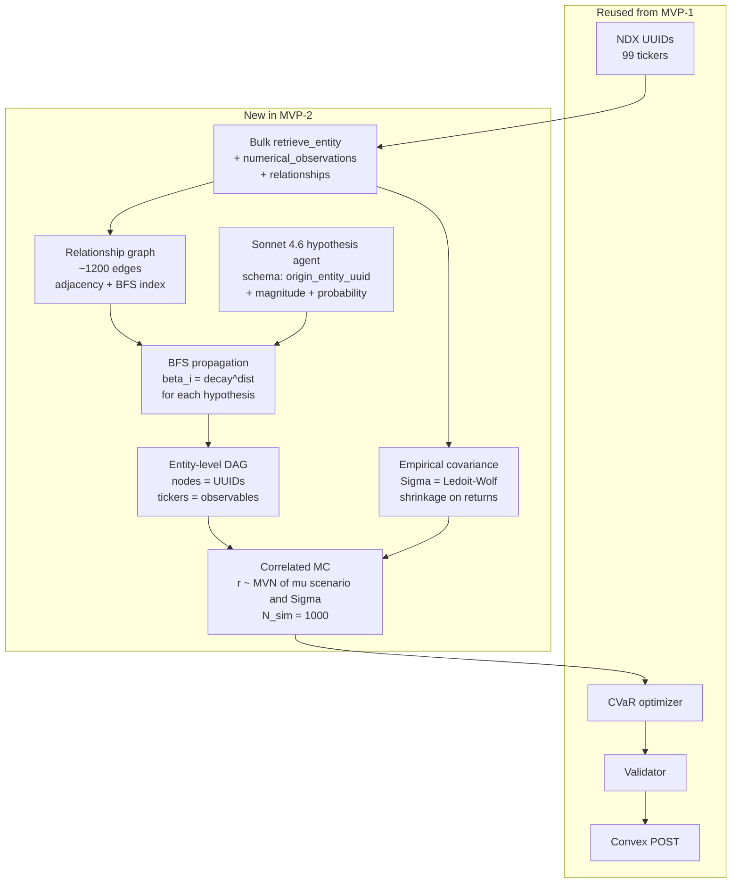

# 03 — MVP-2 Plan: Cala-Grounded Monte Carlo

**Status:** Plan only, no code.
**Audience:** The future Claude agent that will implement this end-to-end.
**Scope:** A second walking skeleton that replaces the structurally broken parts of MVP-1 with a Cala-grounded, graph-propagated Monte Carlo. Same inputs, same leaderboard endpoint, same 99-ticker universe. The output must be a portfolio whose allocation reflects **causal signal from Cala**, not placeholder diversification.
**Prerequisite reading:** `01-mvp-plan.md` (what MVP-1 intended) and `02-mvp-retro.md` (what MVP-1 actually produced). Do NOT start coding until both are read in full.

---

## 0. What MVP-1 already proved — keep it, don't rebuild it

The following gates passed in MVP-1 and the code under `abrollo/` works. Reuse unchanged unless a downstream change forces a surgical edit.

| MVP-1 component | Status | File | Reuse strategy |
|---|---|---|---|
| Cala auth + 429 backoff | ✅ | `abrollo/cala/client.py` | Reuse as-is. Keep the 1.1 s/call bulk throttle (~55 req/min under the ~60 ceiling). |
| NDX → UUID resolution (99/101) | ✅ | `abrollo/cala/ndx.py`, `data/nasdaq100_uuids.json` | Reuse the JSON. Do not re-resolve. |
| Cutoff filter for `retrieve_entity.properties[].sources[].date` | ✅ | `abrollo/cala/cutoff.py` | Reuse for `properties` — that surface IS datable. |
| Sonnet 4.6 forced tool-use for hypothesis emission | ✅ | `abrollo/agents/hypothesis.py` | Reuse the call shape; **change the tool schema** (see §3 Step 5). |
| CVaR optimizer (SCS, phase-2 support selection at k=60) | ✅ | `abrollo/opt/cvar.py` | Reuse as-is. Input shape doesn't change. |
| Submission-rule validator | ✅ | `abrollo/submit/validator.py` | Reuse. Add one check (§3 Step 9). |
| Convex POST client (`nasdaq_code`, `amount`) | ✅ | `abrollo/submit/client.py` | Reuse. The schema-fix lesson is already baked in. |

**Explicit directive:** if you find yourself rewriting any of the above, stop and re-read `02-mvp-retro.md`. The MVP-1 retro is load-bearing context.

---

## 1. Structural flaws in MVP-1 that MUST NOT be replicated

These are the *reason* MVP-2 exists. A future agent that blindly follows MVP-1 will reproduce all of them. Each is tied to a specific MVP-1 artifact.

### Flaw 1 — Monte Carlo samples tickers independently
`abrollo/mc/sim.py` draws each of the 97 non-DAG tickers from `N(0.05, 0.20)` with no cross-ticker covariance. Consequence (retro §"What we learned about the math"): CVaR₅ = –0.5% is artificially thin because independent tickers cannot produce "everything red" days. Systemic shocks become mathematically impossible.
→ **Fix:** empirical covariance Σ fitted from Cala `numerical_observations`. See §3 Step 3.

### Flaw 2 — The DAG is a ticker graph with 2 leaves
`data/dag/mvp.pkl` has 5 nodes, only NVDA and AMD are leaves. 97/99 tickers carry zero DAG-derived signal (retro top-3 issue #2).
→ **Fix:** DAG nodes become **Cala entity UUIDs**, tickers become observables attached via β. See §3 Step 6.

### Flaw 3 — Hypotheses carry a single `effect_target` ticker
`data/hypotheses/semi.json` has 9 distinct `effect_target` tickers across 10 hypotheses. That's the structural reason only a handful of tickers carry signal. A "Taiwan escalation" event cannot hit NVDA, AMD, AAPL, QCOM, AVGO simultaneously under this schema.
→ **Fix:** hypothesis schema changes to `origin_entity_uuid` + `magnitude`; fan-out to tickers is computed by BFS on Cala's relationship graph. See §3 Step 5.

### Flaw 4 — Cutoff filter is decorative on `knowledge_search.context`
Retro top-3 issue #1. `context` items have no `date` field, so strict filtering deletes everything and we silently fall back to trusting Cala's query wording. Real lookahead risk.
→ **Fix:** MVP-2 does NOT use `knowledge_search.context` as citation surface. All hypothesis citations must resolve to a UUID with `retrieve_entity.properties[].sources[].date ≤ 2025-04-15`. Narrative from `knowledge_search.content` is allowed for LLM context but not citable.

### Flaw 5 — Placeholder source dates accepted
Three MVP-1 hypotheses cited `2018-01-01` as a date (retro §"date discipline"). The validator accepted them because the mechanical check was only `≤ cutoff`.
→ **Fix:** validator rejects any `source_dates` value that doesn't correspond to a real date string found in the Cala payload handed to the agent. Exact-match required, not range-match.

### Flaw 6 — `retrieve_entity` called with empty body — no numobs returned
Retro §"What we learned about Cala". `POST /v1/entities/{uuid}` with `{}` returns properties and relationships but **not** `numerical_observations`. MVP-1 worked around this by leaning on `knowledge_search` narrative.
→ **Fix:** MVP-2 explicitly requests numobs. Update `abrollo/cala/client.py` to accept a `include_numerical_observations=True` kwarg that sets the body accordingly. See §3 Step 2.

### Flaw 7 — `entity_search` returns foreign subsidiaries
MVP-1 discovered `name=Intel` ranks `INTEL MSC SDN. BHD.` above `INTEL CORP`. 99/101 resolution masked that HON, COST, LIN, CCEP, MELI resolve to subs.
→ **Fix:** NOT in MVP-2 scope. Keep the known-bad resolutions. Flag in retro if they distort Σ meaningfully.

### Flaw 8 — ECOS not installed, solver fell back to `optimal_inaccurate`
→ **Fix:** add `clarabel` or `ecos` to `pyproject.toml` as a hard dependency. Target: `optimal` status.

---

## 2. MVP-2 pipeline — one diagram



Key structural change vs MVP-1: the DAG and the MC are **both** downstream of Cala-derived structure (covariance + relationship graph). The LLM only chooses origins and probabilities.

---

## 3. Step-by-step plan

Format: **Goal → What we do → Validation gate → Budget → Failure mode.**
Total budget target: ~5 hours of implementation. Steps 2, 3, 5, 6 are highest risk.

### Step 1 — Sanity-check MVP-1 artifacts still load

- **Goal:** prove the reuse surface from §0 still works on the current machine.
- **What we do:** write `scripts/mvp2_step1_preflight.py` that (a) loads `data/nasdaq100_uuids.json`, asserts 99 entries; (b) instantiates `abrollo.cala.client.CalaClient`, does one `entity_search(name="Apple", limit=3)` and asserts 200; (c) imports `abrollo.opt.cvar`, `abrollo.submit.validator`, `abrollo.submit.client` without errors.
- **Gate:** script exits 0, prints `[preflight OK]`.
- **Budget:** 10 min.
- **Failure mode:** if Cala key is unset or rotated → stop. Do not proceed to Step 2.

### Step 2 — Bulk fetch `retrieve_entity` with numerical_observations + relationships

- **Goal:** pull the full Cala payload for all 99 resolved UUIDs, including the two things MVP-1 missed.
- **What we do:**
  1. Extend `abrollo/cala/client.py` with `retrieve_entity(uuid, include_properties=True, include_relationships=True, include_numerical_observations=True)`. Body format: check `data/openapi.pinned.json` for the exact include flags. If the pinned spec lists them as a list (`include: [...]`), use that shape.
  2. Write `scripts/mvp2_step2_bulk_retrieve.py`. Iterate the 99 UUIDs with 1.1 s sleep between calls (~110 s total).
  3. Save each raw response to `data/cala_entities/{ticker}.json`. Do not post-process here — keep raw payloads for reproducibility.
- **Gate:** 99/99 files written; each file has non-empty `properties`, non-empty `relationships.outgoing`, and `numerical_observations` length ≥ 100. If fewer than 90 pass all three checks, halt and write a partial retro.
- **Budget:** 30 min (coding + 2 min wall for the fetch).
- **Failure mode:** if numobs come back empty for > 10 tickers, the empirical Σ will be undercovered. Document the gap; proceed anyway but note in §4 output.

### Step 3 — Build the empirical covariance matrix

- **Goal:** replace MVP-1's `N(0.05, 0.20)` placeholder with Σ derived from Cala.
- **What we do:**
  1. Create `abrollo/mc/covariance.py`. Parse each `data/cala_entities/{ticker}.json`:
     - Extract the `numerical_observations` whose `description` / `metric_name` corresponds to a **price or return series** (candidates seen in MVP-1 introspection: `stock_price`, `market_cap`, `total_return`). Prefer the one with the most dated observations.
     - Filter observations to `date ≤ 2025-04-15`. Use the same `filter_entity_by_cutoff` helper from MVP-1 (`abrollo/cala/cutoff.py`) adapted for numobs (`.date` on the observation, not `.sources[].date`).
     - Convert to a monthly log-return series. Align all 99 tickers on the common date index.
  2. If fewer than 24 aligned monthly observations survive per ticker, **fall back**: use a single-factor approximation `Σ_ij = σ_i · σ_j · ρ` with σ_i from the ticker's own series std and ρ=0.30 constant. Log the fallback loudly.
  3. Estimate Σ with **Ledoit-Wolf shrinkage** (`sklearn.covariance.LedoitWolf`). Shrinkage toward diagonal handles low-sample-count PSD problems.
  4. Save Σ + ticker order to `data/cov/mvp2.npz` with keys `sigma`, `tickers`, `n_obs`, `shrinkage_coef`.
- **Gate:** (a) Σ is PSD (`numpy.linalg.eigvalsh(sigma).min() > -1e-10`); (b) shape is (99, 99); (c) max off-diagonal correlation ≤ 0.99 (no duplicate series); (d) median correlation in [0.1, 0.6] (sanity — tech stocks are correlated but not identical).
- **Budget:** 60 min. Highest-risk step in MVP-2 because it depends on Cala numobs coverage being decent.
- **Failure mode:** if (d) fails with median > 0.9, probably you aligned the same index series across tickers — debug before continuing. If median < 0.05, the series are not returns (probably levels). Convert to log-diffs and retry.

### Step 4 — Build the relationship graph + BFS index

- **Goal:** turn Cala's `relationships.outgoing` into a queryable graph for hypothesis propagation.
- **What we do:**
  1. Create `abrollo/dag/graph.py`. Build a directed multigraph in `networkx` (`DiGraph` is enough — relation *type* goes in edge attributes):
     - Node set: the union of (a) all 99 NDX UUIDs, (b) every UUID appearing as a target in any ticker's `relationships.outgoing`, (c) every UUID appearing as a source in `relationships.incoming` if present.
     - Edge set: for each ticker UUID `u`, for each outgoing rel `r` with target `v` and type `t`, add edge `(u, v, {type: t})`. Also add reverse edges for incoming rels.
  2. Add a `bfs_fanout(origin_uuid, max_hops=2, decay=0.6) -> dict[uuid, float]` helper that returns β values per reachable node. Target cap per BFS: 200 nodes (break ties by shortest path, then by degree).
  3. Save the graph as `data/graph/mvp2.gpickle` and a human-readable edge list summary at `data/graph/mvp2_summary.json` (counts: nodes, edges, average out-degree, connected components).
- **Gate:** (a) graph has ≥ 500 nodes and ≥ 1000 edges (MVP-1 retro estimated ~1200 edges from 10–14 rels × 99 tickers); (b) `bfs_fanout` from any of 3 test origins (pick `Taiwan`, `Intel`, `Federal Reserve` if present; otherwise 3 hub nodes by degree) returns ≥ 20 NDX tickers within β > 0.1.
- **Budget:** 45 min.
- **Failure mode:** if (b) fails (most origins reach < 5 NDX tickers), the relationship graph is too sparse to carry systemic shocks. Widen `max_hops` to 3 before giving up. If still sparse, document in retro — the Cala graph may need enrichment via `knowledge_query` entity expansion (out of scope for MVP-2).

### Step 5 — Hypothesis agent with new schema

- **Goal:** emit hypotheses that name an origin entity (one UUID), not a target ticker.
- **What we do:**
  1. Change the Anthropic tool schema from MVP-1's `HypothesisV1` to `HypothesisV2`:
     ```json
     {
       "id": "string",
       "trigger": "string (<=200 chars, no post-cutoff dates)",
       "origin_entity_uuid": "string (MUST appear in allow-list)",
       "probability": "float in [0, 1]",
       "magnitude": "float in [-0.5, 0.5]  (expected return shock at origin)",
       "horizon_days": "int in [1, 365]",
       "sources": ["array of Cala UUIDs that must be in the allow-list"],
       "source_dates": ["array of ISO dates that must APPEAR VERBATIM in the allow-list dates"]
     }
     ```
  2. Build the allow-list programmatically from `data/cala_entities/*.json`:
     - Allowed origin UUIDs: the union of node UUIDs in `data/graph/mvp2.gpickle`.
     - Allowed source dates: the set of every `properties[].sources[].date` string, filtered to ≤ 2025-04-15.
  3. System prompt must:
     - Enumerate valid origin UUIDs with human-readable names (top 50 by graph degree — full 500+ would blow the context; sample the hubs).
     - Explicitly forbid inventing dates: "Every `source_dates` value must be copy-pasted from the `allowed_dates` list below."
     - Require 10 hypotheses with **distinct `origin_entity_uuid`** values (forces domain spread).
  4. Call Sonnet 4.6 with forced tool-use. Save to `data/hypotheses/mvp2.json`.
- **Gate:** (a) 10 hypotheses returned; (b) 10/10 schema-valid; (c) 10/10 origin UUIDs in allow-list; (d) 10/10 `source_dates` values match the allow-list verbatim (no `2018-01-01` placeholders this time); (e) ≥ 8 distinct origins.
- **Budget:** 45 min.
- **Cost:** ~$0.05–$0.15 depending on how many allow-list entries we inject into the prompt.
- **Failure mode:** if (d) fails, the validator must reject those hypotheses and we retry the call with a stronger prompt. Hard-fail after 2 retries.

### Step 6 — Entity-level DAG + propagation to tickers

- **Goal:** turn the 10 hypotheses into a propagation structure that reaches ≥30 of 99 tickers.
- **What we do:**
  1. Create `abrollo/dag/propagation.py`. For each hypothesis `h`:
     - `affected = bfs_fanout(h.origin_entity_uuid, max_hops=2, decay=0.6)`
     - Intersect with the 99 NDX tickers: `ticker_betas = {ticker: beta for ticker, beta in affected.items() if ticker in NDX}`
     - Record `shift_per_ticker[ticker][h.id] = beta * h.magnitude`
  2. Build a shallow `pgmpy.BayesianNetwork`:
     - One root node per hypothesis with CPT `P(H=1) = h.probability`.
     - No intermediate nodes — the DAG is just independent Bernoullis. Correlation between tickers comes from Σ in Step 3, not from shared DAG ancestors.
     - This is deliberate: the covariance matrix already encodes historical co-movement; the DAG only adds named-shock overlays.
  3. Save to `data/dag/mvp2.pkl` and a human-readable `data/dag/mvp2.json` listing `origin → affected_tickers_with_beta`.
- **Gate:** (a) `check_model()` = True; (b) union of `ticker_betas` across all 10 hypotheses covers ≥ 30 distinct NDX tickers (the retro target); (c) at least 2 hypotheses overlap on some ticker (proves shared exposure works).
- **Budget:** 45 min.
- **Failure mode:** if (b) fails with < 15 tickers, the BFS is too narrow. Increase `max_hops` to 3 and rerun. If still < 15, return to Step 5 and force Sonnet to pick hub origins.

### Step 7 — Correlated Monte Carlo

- **Goal:** 1000 scenarios drawn from MVN(μ_s, Σ), where μ_s is the per-scenario mean with propagated shifts applied.
- **What we do:**
  1. Rewrite `abrollo/mc/sim.py` (new module, don't edit the MVP-1 file in place — add `sim_mvp2.py` alongside):
     ```
     for s in range(1000):
         h_states = [bernoulli(h.probability) for h in hypotheses]
         mu = mu_base.copy()  # zero vector or small drift
         for h, state in zip(hypotheses, h_states):
             if state:
                 for ticker, shift in shift_per_ticker_by_h[h.id].items():
                     mu[idx[ticker]] += shift
         scenarios[s] = multivariate_normal(mean=mu, cov=sigma).rvs()
     ```
  2. Use `numpy.random.multivariate_normal` with `check_valid='raise'`. If Σ isn't PSD at this stage, you missed the Step 3 gate — go back.
  3. Save to `data/scenarios/mvp2.parquet` + `data/scenarios/mvp2_meta.json` (N_sim, ticker order, hypothesis ids, Σ source).
- **Gate:** (a) shape (1000, 99); (b) no NaN / inf; (c) per-ticker std > 0; (d) **empirical correlation matrix of the scenario output matches Σ within 0.1 on the median off-diagonal** (proves correlation is actually flowing); (e) CVaR₅ on an equal-weight portfolio is between –8% and –1% (fatter tails than MVP-1's –0.5%; if still too thin, Σ is undercooked).
- **Budget:** 40 min.
- **Failure mode:** if (d) fails, you're probably sampling the independent noise wrong. Review the MVN draw.

### Step 8 — CVaR optimizer (reuse, one solver change)

- **Goal:** portfolio weights under the same constraints as MVP-1.
- **What we do:** import `abrollo.opt.cvar` and call it on `data/scenarios/mvp2.parquet`. Install `clarabel` via pyproject. Pass `solver="CLARABEL"` so we target `optimal` instead of `optimal_inaccurate`.
- **Gate:** (a) solver status is `optimal` (not `optimal_inaccurate`); (b) 60 non-zero tickers; (c) each ≥ $5,000; (d) sum = $1,000,000 exact; (e) **at least 5 of the 30+ DAG-affected tickers have non-zero weight** (proves the DAG signal actually moved allocation, unlike MVP-1 where NVDA/AMD were zeroed out).
- **Budget:** 20 min.
- **Failure mode:** if (e) fails, the DAG shocks are dominated by the baseline 5% drift. Reduce `mu_base` toward zero and rerun MC.

### Step 9 — Validator, with the two new checks

- **Goal:** green-light the portfolio before network.
- **What we do:** extend `abrollo/submit/validator.py` with:
  1. **Placeholder-date rejector:** for every hypothesis used, every `source_dates` value must appear in the allow-list built in Step 5. Reject otherwise.
  2. **Origin-not-ticker check:** `origin_entity_uuid` must NOT equal any ticker UUID from `data/nasdaq100_uuids.json` (forces origins to be macro/thematic entities; tickers are observables).
- **Gate:** validator passes the Step 8 portfolio and rejects a manually-crafted bad hypothesis (placeholder date `1999-01-01`).
- **Budget:** 20 min.

### Step 10 — Submit

- **Goal:** one clean submission.
- **What we do:** reuse `abrollo/submit/client.py`. `team_id="abrollo"`, `model_agent_name="monte-carlo-cathedral-mvp2"`, `model_agent_version="0.0.2"`. Body fields `nasdaq_code` + `amount` (the MVP-1 schema-fix lesson is already in code). Save to `data/submissions/mvp2_run_<timestamp>.json`.
- **Gate:** HTTP 200, `total_value` present in response, submission_id captured.
- **Budget:** 10 min.

### Step 11 — Retro (`docs/architecture/04-mvp-2-retro.md`)

- **Goal:** document what changed quantitatively vs MVP-1.
- **What we do:** one markdown file with a comparison table:
  | Metric | MVP-1 | MVP-2 | Delta |
  |---|---|---|---|
  | Tickers with DAG signal | 2 / 99 | ? | should be ≥ 30 |
  | Median off-diagonal correlation in scenarios | ~0 | ? | should be 0.1–0.6 |
  | CVaR₅ on $1M portfolio | –0.5% | ? | should be deeper |
  | Solver status | `optimal_inaccurate` | ? | should be `optimal` |
  | Hypotheses with placeholder dates | 3/10 | ? | should be 0 |
  | Final portfolio value | $1,473,435.33 | ? | — |
- **Gate:** file exists, table filled in, top 3 issues for a hypothetical MVP-3 listed.
- **Budget:** 20 min.

---

## 4. File / artifact layout at MVP-2 end

```
project_abrollo/
├── docs/architecture/
│   ├── 00-cto-design.md
│   ├── 01-mvp-plan.md
│   ├── 02-mvp-retro.md
│   ├── 03-mvp-2-plan.md         <- this file
│   └── 04-mvp-2-retro.md        <- produced in Step 11
├── abrollo/
│   ├── cala/
│   │   ├── client.py            <- extended: include_numerical_observations kwarg
│   │   ├── cutoff.py            <- extended: numobs date filter
│   │   └── ndx.py               <- unchanged
│   ├── agents/
│   │   ├── hypothesis.py        <- unchanged
│   │   └── hypothesis_v2.py     <- NEW: HypothesisV2 schema + Sonnet call
│   ├── dag/
│   │   ├── mvp_dag.py           <- keep (MVP-1)
│   │   ├── graph.py             <- NEW: relationship graph + BFS
│   │   └── propagation.py       <- NEW: hypothesis → ticker shifts
│   ├── mc/
│   │   ├── sim.py               <- keep (MVP-1)
│   │   ├── sim_mvp2.py          <- NEW: correlated MVN draw
│   │   └── covariance.py        <- NEW: empirical Σ + Ledoit-Wolf
│   ├── opt/cvar.py              <- unchanged interface; pass solver="CLARABEL"
│   └── submit/
│       ├── validator.py         <- extended: 2 new checks (Step 9)
│       └── client.py            <- unchanged
├── scripts/
│   ├── mvp2_step1_preflight.py
│   ├── mvp2_step2_bulk_retrieve.py
│   ├── mvp2_step3_covariance.py
│   ├── mvp2_step4_graph.py
│   ├── mvp2_step5_hypotheses.py
│   ├── mvp2_step6_propagation.py
│   ├── mvp2_step7_mc.py
│   ├── mvp2_step8_optimize.py
│   ├── mvp2_step9_validate.py
│   ├── mvp2_step10_submit.py
│   └── mvp2_run_all.py          <- optional: orchestrate 1 → 10
├── data/
│   ├── (everything from MVP-1, untouched)
│   ├── cala_entities/{ticker}.json            (99 files, new)
│   ├── cov/mvp2.npz
│   ├── graph/mvp2.gpickle
│   ├── graph/mvp2_summary.json
│   ├── hypotheses/mvp2.json
│   ├── dag/mvp2.pkl
│   ├── dag/mvp2.json
│   ├── scenarios/mvp2.parquet
│   ├── scenarios/mvp2_meta.json
│   ├── portfolios/mvp2.json
│   └── submissions/mvp2_run_*.json
└── pyproject.toml               <- + networkx, + scikit-learn, + clarabel
```

---

## 5. Dependencies — deltas vs MVP-1

| Package | Version | Purpose |
|---|---|---|
| `networkx` | `>=3.2` | Relationship graph + BFS |
| `scikit-learn` | `>=1.5` | `LedoitWolf` covariance estimator |
| `clarabel` | `>=0.9` | cvxpy solver targeting `optimal` (not `optimal_inaccurate`) |

No other additions. Do NOT introduce `httpx`, `asyncio`, `polars`, `duckdb`, `langchain`, any vector DB, or any orchestration framework. The MVP-1 explicit-rejection list in `01-mvp-plan.md §5` still applies.

---

## 6. Risks specific to MVP-2

| # | Risk | Likelihood | Blast radius | Mitigation |
|---|---|---|---|---|
| R1 | Cala `numerical_observations` coverage is too thin to build a stable Σ (< 24 monthly obs per ticker) | medium | Step 3 gate fails | Single-factor fallback (`σ_i σ_j ρ`) already in Step 3. Document in retro. |
| R2 | Relationship graph is star-shaped (most origins reach < 20 tickers) | medium | Step 6 gate (b) fails | Increase `max_hops` to 3; if still sparse, Sonnet must pick hub origins (hubs by out-degree in `mvp2_summary.json`) |
| R3 | Sonnet keeps inventing `source_dates` despite verbatim-match rule | medium | Step 5 gate (d) fails | Retry with the allow-list injected as a JSON array in the user message, not just mentioned in the system prompt. Hard-fail after 2 retries — do not weaken the rule. |
| R4 | CLARABEL fails to install on Windows | low | Step 8 falls back to SCS | Document and accept `optimal_inaccurate` in the retro |
| R5 | Σ has negative eigenvalues after Ledoit-Wolf | low | MVN draw raises | Add a `nearest_psd` projection before saving Σ |
| R6 | Ticker UUIDs accidentally used as hypothesis origins | medium | Propagation degenerates to MVP-1 behavior | Validator check in Step 9 catches this; also filter allow-list origins to UUIDs that are NOT in `nasdaq100_uuids.json` |
| R7 | Bulk retrieve trips the 60 req/min ceiling | low | Step 2 takes longer | 1.1 s sleep is already conservative; if 429 still fires, bump to 1.5 s |

---

## 7. Non-goals for MVP-2 (strict)

- **No new agents.** One hypothesis-emitting Sonnet call, same as MVP-1.
- **No Wedge-tier fan-out.** 10 hypotheses, not 50, not 300.
- **No auto-DAG learning.** The DAG structure is "one root per hypothesis, no intermediates." Correlation lives in Σ.
- **No retry loops across the whole pipeline.** Each step is a single forward pass.
- **No UI.** stdout + JSON + Parquet.
- **No fix to the foreign-subsidiary resolution problem.** Known bad UUIDs from MVP-1 retro stay bad.
- **No parallelism.** Single-threaded. The bulk `retrieve_entity` loop sleeps between calls.
- **No caching beyond on-disk JSON snapshots per step.**

---

## 8. Definition of done

MVP-2 is complete when **all** of the following are true:

1. Every step 1–11 gate in §3 passes.
2. `docs/architecture/04-mvp-2-retro.md` exists with the comparison table filled in.
3. Final submission receives HTTP 200 from Convex.
4. The number of NDX tickers carrying DAG-derived signal is **≥ 30** (up from 2 in MVP-1).
5. The scenario matrix's median off-diagonal correlation is in [0.1, 0.6] (up from ~0 in MVP-1).
6. Zero hypotheses in `data/hypotheses/mvp2.json` have placeholder source dates.

If any of 4, 5, 6 fails, the pipeline is structurally the same as MVP-1 and MVP-2 has not shipped — regardless of whether a submission went through.

---

## 9. Implementation directives for the future Claude agent

- **Read `02-mvp-retro.md` in full before writing any code.** It is the ground truth for what Cala actually does, not what `01-mvp-plan.md` assumed.
- **Do not refactor MVP-1 code.** Add new modules (`sim_mvp2.py`, `hypothesis_v2.py`, `covariance.py`, `graph.py`, `propagation.py`) alongside. The MVP-1 submission is a working baseline; keep it reproducible.
- **Do not invent Cala endpoint shapes.** Check `data/openapi.pinned.json` first; if ambiguous, make one probe call and print the response before writing the wrapper.
- **Fail loud, not silent.** If a gate fails, raise and halt the script. Do not auto-weaken thresholds. Do not swallow exceptions into warnings.
- **One commit per step.** Commit message format: `mvp2: step N — <one-line outcome>`. Makes the retro easy to write.
- **When in doubt, match MVP-1's vocabulary and file-naming conventions.** Consistency with the existing codebase matters more than personal preference.
